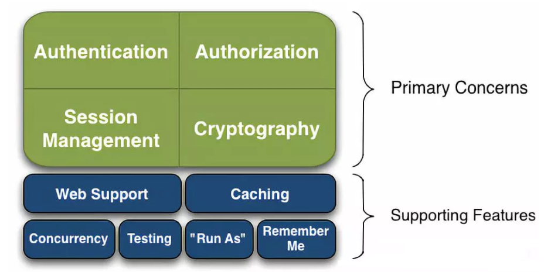
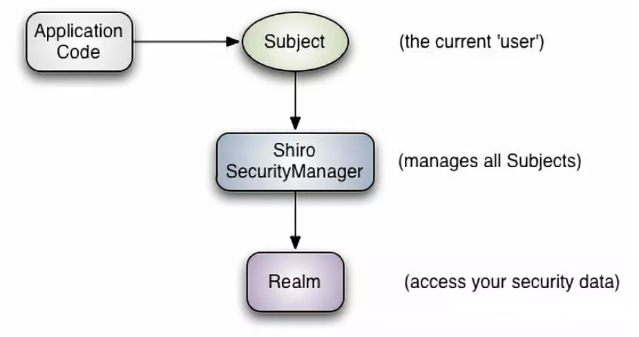
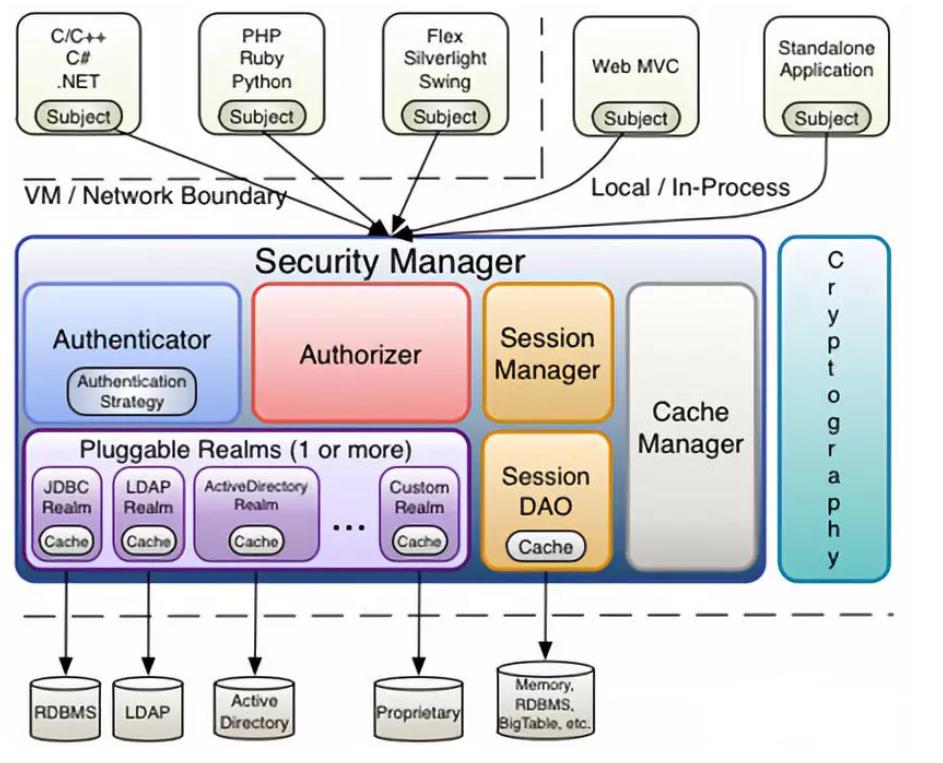

## Shiro 简单了解

简单用过 SpringSecurity 安全框架后，再试试另一个安全框架——Shiro。

### 1. Shiro简介

Apache Shiro 是一个强大且易用的 Java 安全框架：

- Shiro 可以简单地开发出足够好的应用，可以应用在 JavaSE 环境和 JavaEE 环境；
- Shiro 可以完成身份认证、授权、加密、会话管理、Web 集成、缓存等。

> Shiro 源码：https://github.com/apache/shiro



Shiro 的主要功能包括：

- Authentication：身份认证，即验证用户是否有登录的身份；
- Authorization：授权，进行访问控制，即验证已认证用户是否有足够的权限；
- Session Manager：会话管理，即管理用户登录后的会话 Session，用户自登录后，信息都会保存在会话中，会话可以是 JavaSE 环境也可以是 JavaEE 环境；
- Cryptography：加密，保护数据的安全性，如将密码加密保存到数据库中

除此之外还有额外的功能，此处暂且略过。

### 2. Shiro架构

在最高的概念层次上，**Shiro 的架构有三个主要的概念：Subject,，SecurityManager 和 Realm。**



1. Subject：即“当前操作用户”。但是，在 Shiro 中，Subject 这一概念并不仅仅指人，也可以是第三方进程、后台帐户（Daemon Account）或其他类似事物。它仅仅意味着“当前跟软件交互的东西”。
2. SecurityManager：它是 Shiro 框架的核心，典型的[Facade模式](https://baike.baidu.com/item/Facade模式/7557140)。Shiro 通过 SecurityManager 来管理内部组件实例，并通过它来提供安全管理的各种服务。**Subject 代表了当前用户的安全操作，SecurityManager 则管理所有用户的安全操作。**
3. Realm：Realm 充当了 Shiro 与应用安全数据间的“桥梁”或者“连接器”。也就是说，**当对用户执行认证（登录）和授权（访问控制）验证时，Shiro 会从应用配置的 Realm 中查找用户及其权限信息。**Realm 实质上是一个安全相关的 DAO：它封装了数据源的连接细节，并在需要时将相关数据提供给 Shiro。当配置 Shiro 时，必须至少指定一个Realm，用于认证和授权。

Shiro 还有复杂的内部架构：



这里就先不管了，还没研究到这么深的程度。

### 3. 快速开始

通过 Shiro 提供的 Sample 中的 Quickstart 简单了解一下 Shiro 的 API。

```java
public class Quickstart {

    private static final transient Logger log = LoggerFactory.getLogger(Quickstart.class);


    public static void main(String[] args) {

        // 从工厂方法中获取 SecurityManager 实例！ 此处 .ini 文件中保存了用户名、密码和权限的数据。
        Factory<SecurityManager> factory = new IniSecurityManagerFactory("classpath:shiro.ini");
        SecurityManager securityManager = factory.getInstance();

        // 将 SecurityManager 作为 JVM 单例使用
        // 一般应用不会这样做，而是依赖于它们的容器配置，此处仅是为了快速开始
        SecurityUtils.setSecurityManager(securityManager);

        // 简单的 Shiro 环境就搭建好了，接下来可以：

        // 获取当前的执行对象 Subject
        Subject currentUser = SecurityUtils.getSubject();

        // 使用会话 Session 做些事情！（不需要 web 或者 EJB 容器！）
        Session session = currentUser.getSession();
        session.setAttribute("someKey", "aValue");
        String value = (String) session.getAttribute("someKey");
        if (value.equals("aValue")) {
            log.info("Retrieved the correct value! [" + value + "]");
        }

        // 登录当前用户，以查看角色和权限
        // currentUser.isAuthenticated() 检查是否认证（登录）
        if (!currentUser.isAuthenticated()) {
            UsernamePasswordToken token = new UsernamePasswordToken("lonestarr", "vespa");
            token.setRememberMe(true);
            try {
                currentUser.login(token);
            } catch (UnknownAccountException uae) {
                log.info("There is no user with username of " + token.getPrincipal());
            } catch (IncorrectCredentialsException ice) {
                log.info("Password for account " + token.getPrincipal() + " was incorrect!");
            } catch (LockedAccountException lae) {
                log.info("The account for username " + token.getPrincipal() + " is locked.  " +
                        "Please contact your administrator to unlock it.");
            }
            // 通过不同的认证异常进行不同的提示
            catch (AuthenticationException ae) {
                // 抛出了最高的认证异常，是什么情况？错误？
            }
        }

        // 登录成功，表明身份
        log.info("User [" + currentUser.getPrincipal() + "] logged in successfully.");

        // 查看是否具有权限 currentUser.hasRole()
        if (currentUser.hasRole("schwartz")) {
            log.info("May the Schwartz be with you!");
        } else {
            log.info("Hello, mere mortal.");
        }

        // 查看类型化权限（非实例级别） currentUser.isPermitted()
        if (currentUser.isPermitted("lightsaber:wield")) {
            log.info("You may use a lightsaber ring.  Use it wisely.");
        } else {
            log.info("Sorry, lightsaber rings are for schwartz masters only.");
        }

        // （强大的）实例级别权限 （有什么区别？）
        if (currentUser.isPermitted("winnebago:drive:eagle5")) {
            log.info("You are permitted to 'drive' the winnebago with license plate (id) 'eagle5'.  " +
                    "Here are the keys - have fun!");
        } else {
            log.info("Sorry, you aren't allowed to drive the 'eagle5' winnebago!");
        }

        // 完成，注销！
        currentUser.logout();

        System.exit(0);
    }
}
```

通过注释说明了每句代码的作用（也是从原英文注释翻译过来的 = = ），看看其中 API 的使用即可，马上在 SpringBoot 中使用试试！

