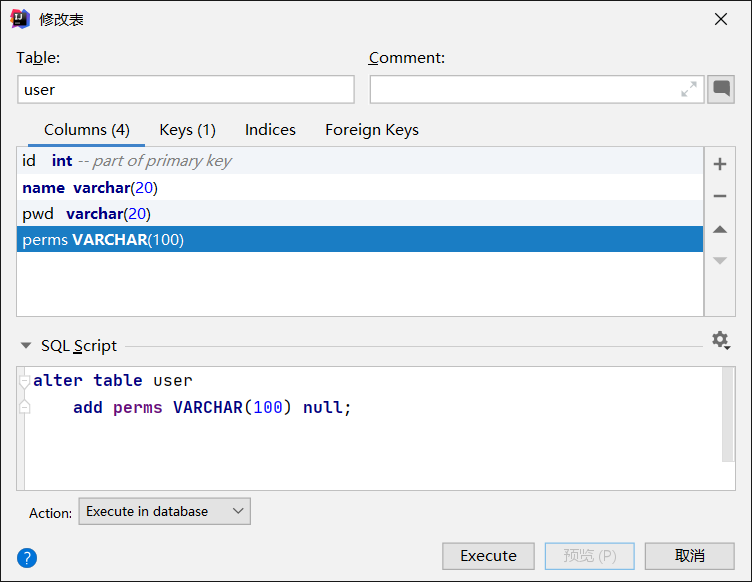

## Shiro 简单使用②

通过整合 MyBatis 连接真实数据库，使用 Shiro 的授权和认证管理！

### 1. 整合MyBatis

顺便复习一下配置连接数据库的步骤！

#### 1.1 导入依赖

首先要导入连接数据库所需的依赖

```xml
<!-- mysql -->
<dependency>
    <groupId>mysql</groupId>
    <artifactId>mysql-connector-java</artifactId>
</dependency>
<!-- mybatis -->
<dependency>
    <groupId>org.mybatis.spring.boot</groupId>
    <artifactId>mybatis-spring-boot-starter</artifactId>
    <version>2.2.0</version>
</dependency>
<!-- lombok -->
<dependency>
    <groupId>org.projectlombok</groupId>
    <artifactId>lombok</artifactId>
</dependency>
<!-- log4j -->
<dependency>
    <groupId>log4j</groupId>
    <artifactId>log4j</artifactId>
    <version>1.2.17</version>
</dependency>
<!-- Druid -->
<dependency>
    <groupId>com.alibaba</groupId>
    <artifactId>druid-spring-boot-starter</artifactId>
    <version>1.2.6</version>
</dependency>
```

#### 1.2 配置文件

在 application.yaml 文件中进行数据源的配置

```yaml
spring:
  datasource:
    username: root
    password: '0723'
    # serverTimezone=UTC 解决时区问题
    url: jdbc:mysql://localhost:3306/mybatis?serverTimezone=UTC&useUnicode=true&characterEncoding=utf-8
    # mysql8 以上使用 cj
    driver-class-name: com.mysql.cj.jdbc.Driver
    type: com.alibaba.druid.pool.DruidDataSource
    #druid 数据源专有配置
    druid:
      initialSize: 5
      minIdle: 5
      maxActive: 20
      maxWait: 60000
      timeBetweenEvictionRunsMillis: 60000
      minEvictableIdleTimeMillis: 300000
      validationQuery: SELECT 1 FROM DUAL
      testWhileIdle: true
      testOnBorrow: false
      testOnReturn: false
      poolPreparedStatements: true
      #配置监控统计拦截的filters，stat:监控统计 log4j:日志记录 wall:防御sql注入
      filters: stat,wall,log4j
      maxPoolPreparedStatementPerConnectionSize: 20
      useGlobalDataSourceStat: true
      connectionProperties: druid.stat.mergeSql=true;druid.stat.slowSqlMillis=500
```

还有 MyBatis 的包别名以及映射文件位置的配置

```yaml
mybatis:
  type-aliases-package: com.qiyuan.entity
  mapper-locations: classpath:mapper/*.xml
```

其中配置了实体类在 entity 包下，映射文件在类路径 resource 下的 mapper 目录中。

#### 1.3  编写实体类

根据数据库中的字段编写实体类，**目前**就三个字段

```java
package com.qiyuan.entity;

@Data
@AllArgsConstructor
@NoArgsConstructor
public class User {
    private int id;
    private String name;
    private String pwd;
}
```

#### 1.4 编写Mapper接口

在 com.qiyuan.mapper 下编写数据库操作的接口 UserMapper

```java
package com.qiyuan.mapper;

@Repository
// 表示本接口是 MyBatis 的接口，必须添加才能被 Spring 放到容器中！
@Mapper
public interface UserMapper {
    public User queryUserByName(String name);
}
```

#### 1.5 编写Mapper.xml

在类路径下的 mapper 目录中存放 Mapper.xml 文件，实现接口中的数据库操作

```xml
<?xml version="1.0" encoding="UTF-8" ?>
<!DOCTYPE mapper
        PUBLIC "-//mybatis.org//DTD Mapper 3.0//EN"
        "http://mybatis.org/dtd/mybatis-3-mapper.dtd">
<!-- 命名空间：接口类 -->
<mapper namespace="com.qiyuan.mapper.UserMapper">

    <!-- 配置了包扫描，此处就可以直接用 User 而不用全路径名 -->
    <select id="queryUserByName" parameterType="String" resultType="User">
        select * from user where name=#{name}
    </select>

</mapper>
```

#### 1.6 编写Service层

通过编写 Service 层的接口和实现类，封装 DAO 层对数据库的操作，即使 Service 层只是调用了 DAO 层而没有添加其他操作，实际中也要使用 Service 层而不能只有 DAO 层！

Service 接口

```java
package com.qiyuan.service;

public interface UserService {
    public User queryUserByName(String name);
}
```

Service 接口实现类

```java
package com.qiyuan.service;

@Service
public class UserServiceImpl implements UserService{

    // 注入 DAO 层对象以进行操作
    @Autowired
    UserMapper userMapper;

    @Override
    public User queryUserByName(String name) {
        return userMapper.queryUserByName(name);
    }
}
```

编写完 Service 层后，就可以进行业务的测试了，为了后面不出问题最好还是先测试一下

```java
@SpringBootTest
class SpringBoot08ShiroApplicationTests {

    @Autowired
    UserServiceImpl userService;

    @Test
    void contextLoads() {
        System.out.println(userService.queryUserByName("祈鸢"));
    }

}
// 输出：User(id=1, name=祈鸢, pwd=123456)
```

这样一个数据库查询的业务就完成了！

### 2. 用户认证

现在只要在 Realm 类中调用 UserService 执行查询业务就能获取到数据库中的用户数据了！

```java
// 自定义的 Realm 需要继承 AuthorizingRealm 并实现其中的方法
public class UserRealm extends AuthorizingRealm {

    // 注入 Service 层，执行业务！
    @Autowired
    UserServiceImpl userService;

    @Override
    // 授权信息
    protected AuthorizationInfo doGetAuthorizationInfo(PrincipalCollection collection) {
        System.out.println("执行了 授权 方法 doGetAuthorizationInfo！");
        return null;
    }

    @Override
    // 认证信息
    protected AuthenticationInfo doGetAuthenticationInfo(AuthenticationToken token) throws AuthenticationException {
        System.out.println("执行了 认证 方法 doGetAuthenticationInfo！");
        // 将 Token 参数转换为我们需要的类型
        UsernamePasswordToken upToken = (UsernamePasswordToken)token;
        // 在数据库中进行查询
        User user = userService.queryUserByName(upToken.getUsername());
        // 用户名认证
        if( user==null ){
            // 查询不到，抛出 UnknowAccountException 异常！
            return null;
        }
        // 密码认证，直接交给 Shiro 做！
        return new SimpleAuthenticationInfo("",user.getPwd(),"");
    }
}
```

此时的登录认证功能就已经和数据库中的数据结合起来了！

但是现在的密码在数据库中是明文存储的，且 Realm 类中也没有对密码进行加密，是不安全的。

### 3. 授权管理

#### 3.1 权限拦截

要想给某页面（也可以是很多页面）添加对应的权限，只需要在 `ShiroFilterFactoryBean` 中的过滤器 Map 中添加页面对应的权限即可

```java
        // 添加授权管理
        filterMap.put("/user/add","perms[user:add]");
```

此时访问 add 页面，会出现401未授权错误，但此时的页面仍是 SpringBoot 的白页，所以需要自定义设置一个未授权页面，这里先设置控制器简单地返回一条错误信息

```java
@Controller
public class MyController {
    ...

    @RequestMapping("/unauth")
    @ResponseBody
    public String unauthorized(){
        return "未授权无法访问";
    }
}
```

然后在 `ShiroFilterFactoryBean` 中设置访问未授权页面时的跳转请求，和设置登录页一样

```java
        // 无权限前往登录页，同 SpringSecurity！
        bean.setLoginUrl("/toLogin");
        // 未授权前往 /unauth
        bean.setUnauthorizedUrl("/unauth");
```

此时进入未授权的页面就会跳转到 `/unauth` 请求，看到我们自定义的页面了。

再额外提一下，一个用户登录时，控制台会输出 `执行了 认证 方法`，即 UserRealm 类中的 `doGetAuthenticationInfo` 方法；当登录后的用户进入设置了权限的页面时，控制台会输出 `执行了 授权 方法`，即 UserRealm 类中的 `doGetAuthorizationInfo` 方法！

#### 3.2 用户授权

为了让用户能正常访问某些页面，肯定要赋予他们对于的权限，而每个用户的权限自然是保存在数据库中的，所以需要为 user 表添加一个权限 perms 字段



数据库中添加了字段后，还需要为该字段赋值，并且在实体类中添加对应的属性。

这时从数据库中查询出来的 User 对象已经具有 perms 属性了，在 UserRealm 类的授权方法中就可以进行赋予权限的操作！

为了在授权方法中能获取到用户的数据，需要设置认证方法中返回的对象的 principal 属性为用户对象 user

```java
        // 密码认证，直接交给 Shiro 做！
        // 将 principal 参数设置为 user，subject 就可以获取到！
        return new SimpleAuthenticationInfo(user,user.getPwd(),"");
```

然后在授权方法中获取这个对象，再获取其中的 perms 属性，添加其中的权限即可，此时具有完整认证授权功能的 UserRealm 类为

```java
// 自定义的 Realm 需要继承 AuthorizingRealm 并实现其中的方法
public class UserRealm extends AuthorizingRealm {

    // 注入 Service 层，执行业务！
    @Autowired
    UserServiceImpl userService;

    @Override
    // 授权信息
    protected AuthorizationInfo doGetAuthorizationInfo(PrincipalCollection collection) {
        System.out.println("执行了 授权 方法 doGetAuthorizationInfo！");
        // 授权信息对象
        SimpleAuthorizationInfo info = new SimpleAuthorizationInfo();
        // 获取当前执行操作的用户
        Subject subject = SecurityUtils.getSubject();
        // 获取认证方法中设置的 principal 参数，即 User 对象
        User currentUser = (User) subject.getPrincipal();
        // 添加授权信息
        info.addStringPermission(currentUser.getPerms());
        // 返回授权信息对象
        return info;
    }

    @Override
    // 认证信息
    protected AuthenticationInfo doGetAuthenticationInfo(AuthenticationToken token) throws AuthenticationException {
        System.out.println("执行了 认证 方法 doGetAuthenticationInfo！");
        // 将 Token 参数转换为我们需要的类型
        UsernamePasswordToken upToken = (UsernamePasswordToken)token;
        // 在数据库中进行查询
        User user = userService.queryUserByName(upToken.getUsername());
        // 用户名认证
        if( user==null ){
            // 查询不到，抛出 UnknowAccountException 异常！
            return null;
        }
        // 密码认证，直接交给 Shiro 做！
        // 将 principal 参数设置为 user，subject 就可以获取到！
        return new SimpleAuthenticationInfo(user,user.getPwd(),"");
    }
}
```

这样网页就能进行认证并授权了。但即使应用中的权限模块会更加复杂，不是一个简单的字段可以解决的，这里仅是为了 Shiro 的学习才用这么简单的例子。

授权管理本还应该和前端页面结合，没有对应的权限则前端页面也不予显示才是正常的业务逻辑。本来还要搞 Shiro 整合 Thymeleaf 的，直接开摆。

### 4. 总结

通过 Shiro 框架实现了网站的认证和授权管理，相比 SpringSecurity，Shiro 更加复杂但可定制程度也更高，网站业务需求不复杂的话还是用 SpringSecurity 更简单。
