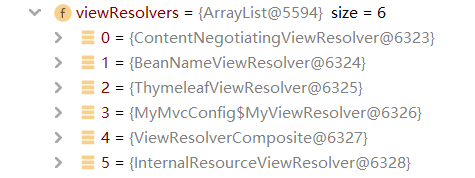

## SpringBoot MVC配置

在使用 SpringBoot 进行实际的项目开发前，最后再了解一下 SpringBoot 中对于 MVC 的配置！仍对应 SpringBoot-03-Web 项目。

### 1. MVC配置简介

SpringBoot 对 MVC 进行了许多的配置，查看官方文档可以看到其中的介绍

```java
Spring MVC Auto-configuration
// Spring Boot 为 Spring MVC 提供了自动配置，它可以很好地与大多数应用程序一起工作。
Spring Boot provides auto-configuration for Spring MVC that works well with most applications.
// 自动配置在 Spring 默认设置的基础上添加了以下功能：
The auto-configuration adds the following features on top of Spring’s defaults:
// 包含了视图解析器
Inclusion of ContentNegotiatingViewResolver and BeanNameViewResolver beans.
// 支持静态资源文件夹的路径和 WebJars
Support for serving static resources, including support for WebJars 
// 自动注册了 Converter（转换器），作用是将网页提交到后台的数据封装为对象
// 如提交字符串"1" 就会转换为 int 类型的 1
// Formatte（格式化器），可以将如2021-9-1格式的数据格式化为 Date 对象
Automatic registration of Converter, GenericConverter, and Formatter beans.
// 提供了 HttpMessageConverters支持
// 它是 SpringMVC 用来转换 Http 请求和响应的的，如将一个User对象转换为JSON字符串（详细的请查看文档）
Support for HttpMessageConverters (covered later in this document).
// 定义错误代码生成规则的
Automatic registration of MessageCodesResolver (covered later in this document).
// 首页定制
Static index.html support.
// 图标定制
Custom Favicon support (covered later in this document).
// 初始化数据绑定器：把请求数据绑定到 JavaBean 中！
Automatic use of a ConfigurableWebBindingInitializer bean (covered later in this document).
```

接下来就分析一下其中的几个配置！

### 2. 视图解析器

#### 2.1 配置

SpringBoot 对 MVC 中的视图解析器进行了自动配置，首先查看 Web 的自动配置类 `WebMvcAutoConfiguration`，在其中可以看到视图解析器的构造方法

```java
@ConditionalOnBean(ViewResolver.class)
@ConditionalOnMissingBean(name = "viewResolver", value = ContentNegotiatingViewResolver.class)
public ContentNegotiatingViewResolver viewResolver(BeanFactory beanFactory) {
    ContentNegotiatingViewResolver resolver = new ContentNegotiatingViewResolver();
    ...
    return resolver;
}
```

它创建了一个 `ContentNegotiatingViewResolver` 类型的视图解析器，点进这个类，首先可以看到它实现了 `ViewResolver` 接口，所以它就是一个视图解析器！

```java
public class ContentNegotiatingViewResolver extends WebApplicationObjectSupport
		implements ViewResolver, Ordered, InitializingBean
```

再找到它关于视图解析的部分，是一个方法 `resolveViewName`，返回了一个视图

```java
@Nullable
public View resolveViewName(String viewName, Locale locale) throws Exception {
    RequestAttributes attrs = RequestContextHolder.getRequestAttributes();
    Assert.state(attrs instanceof ServletRequestAttributes, "No current ServletRequestAttributes");
    List<MediaType> requestedMediaTypes = this.getMediaTypes(((ServletRequestAttributes)attrs).getRequest());
    if (requestedMediaTypes != null) {
        List<View> candidateViews = this.getCandidateViews(viewName, locale, requestedMediaTypes);
        View bestView = this.getBestView(candidateViews, requestedMediaTypes, attrs);
        if (bestView != null) {
            return bestView;
        }
    }

    String mediaTypeInfo = this.logger.isDebugEnabled() && requestedMediaTypes != null ? " given " + requestedMediaTypes.toString() : "";
    if (this.useNotAcceptableStatusCode) {
        if (this.logger.isDebugEnabled()) {
            this.logger.debug("Using 406 NOT_ACCEPTABLE" + mediaTypeInfo);
        }

        return NOT_ACCEPTABLE_VIEW;
    } else {
        this.logger.debug("View remains unresolved" + mediaTypeInfo);
        return null;
    }
}
```

其中有两句关键的代码

```java
// 获取所有候选视图
List<View> candidateViews = this.getCandidateViews(viewName, locale, requestedMediaTypes);
// 选择最好的视图（何谓最好？）
View bestView = this.getBestView(candidateViews, requestedMediaTypes, attrs);
```

**查看获取所有候选视图方法 `getCandidateViews`，可以看到它遍历了所有的视图解析器，向候选视图列表中添加视图**

```java
List<View> candidateViews = new ArrayList<>();
...
for (ViewResolver viewResolver : this.viewResolvers) {
    View view = viewResolver.resolveViewName(viewName, locale);
    if (view != null) {
        candidateViews.add(view);
    }
    for (MediaType requestedMediaType : requestedMediaTypes) {
        List<String> extensions = this.contentNegotiationManager.resolveFileExtensions(requestedMediaType);
        for (String extension : extensions) {
            String viewNameWithExtension = viewName + '.' + extension;
            view = viewResolver.resolveViewName(viewNameWithExtension, locale);
            if (view != null) {
                candidateViews.add(view);
            }
        }
    }
}
```

这就是 SpringBoot 默认的关于视图解析器的配置！

#### 2.2 自定义

此时我们先尝试自定义一个视图解析器，在 com.qiyuan 包下创建 config 包，并在其中创建 MyMvcConfig 类，添加 `@Configuration` 注解并实现 `WebMvcConfigurer` 接口，表明它是 WebMvc 的配置类

```java
@Configuration
public class MyMvcConfig implements WebMvcConfigurer {
    
}
```

在其中创建一个静态内部类 `MyViewResolver`，实现 `ViewResolver` 接口，即是一个视图解析器；再使用 `@Bean` 将它作为组件放入容器中

```java
@Configuration
public class MyMvcConfig implements WebMvcConfigurer {

    @Bean
    public ViewResolver myViewResolver(){
        return new MyViewResolver();
    }

    // 自定义的视图解析器
    public static class MyViewResolver implements ViewResolver{

        @Override
        public View resolveViewName(String viewName, Locale locale) throws Exception {
            return null;
        }
    }
}
```

这样我们自定义的视图解析器就放入 Spring 中了，运行的时候就会被检测到！

#### 2.3 测试

查看完 SpringBoot 的视图解析器配置，并且有自定义了一个视图解析器的配置后，就可以来测试一下了。

首先在 SpringMVC 中我们知道，任何请求都要经过 `DispatcherServlet`，全局搜索这个类，并找到其中的核心方法 `doDispatcher`

```java
protected void doDispatch(HttpServletRequest request, HttpServletResponse response) throws Exception
```

具体内容是什么不用关心，先在这个方法上打上断点，然后开始程序调试。访问 `localhost:8080`，程序进入了断点。此时查看 `DispatcherServlet` 类中的变量，可以看到 `viewResolver`



这里就出现了四个见过的面孔！`ContentNegotiatingViewResolver` 和 `BeanNameViewResolver` 是 SpringBoot 中的 MVC 配置包含的，`ThymeleafViewResolver` 则是上节导入 `Thymeleaf` 而产生的，最后是 `MyMvcConfig` 中的（ $ 符号应该是表示类中的对象）`MyViewResolver` ，我们自定义的视图解析器！

#### 2.4 小结

从上面的测试中我们就可以知道，SpringBoot 中有默认的配置，它们会被自动装配为组件（如上面的0和 1）；如果我们引入了别的配置，它也会被装配为一个组件（如上面的2，Thymeleaf ）；如果我们想自定义地为 SpringBoot 添加组件，只要写好对应的配置类，将这个组件放到 Spring 容器中，它也会自动地被装配（如上面的3，MyViewResolver ）！

简而言之，如果我们想要进行一些功能的定制，只要给 Spring 容器添加这个功能的组件就行了！

### 3. 扩展MVC功能

现在来尝试扩展 MVC 的功能，在官方文档中，还有这么一段话

```java
/*
如果您希望保留Spring Boot MVC功能，并且希望添加其他MVC配置（拦截器、格式化程序、视图控制器和其他功能）,
则可以添加自己的@configuration类，类型为webmvcconfigurer，但不添加@EnableWebMvc。
如果希望提供RequestMappingHandlerMapping、RequestMappingHandlerAdapter或ExceptionHandlerExceptionResolver的自定义实例，
则可以声明WebMVCregistrationAdapter实例来提供此类组件。
*/
If you want to keep Spring Boot MVC features and you want to add additional MVC configuration 
(interceptors, formatters, view controllers, and other features), you can add your own 
@Configuration class of type WebMvcConfigurer but without @EnableWebMvc. If you wish to provide 
custom instances of RequestMappingHandlerMapping, RequestMappingHandlerAdapter, or 
ExceptionHandlerExceptionResolver, you can declare a WebMvcRegistrationsAdapter instance to provide such components.
```

即如果需要添加功能，即创建一个 `WebMvcConfigurer` 类并加上 `@Configuration` 注解，也就是上面创建视图解析器的过程，当然也可以创建拦截器、视图控制器等组件。

现在尝试创建一个视图控制器，在 `MyMvcConfig` 类中重写 `addViewControllers` 方法

```java
@Configuration
public class MyMvcConfig implements WebMvcConfigurer {

    ...

    @Override
    public void addViewControllers(ViewControllerRegistry registry) {
        // 将 /test 请求定向到 hello 视图
        registry.addViewController("/test").setViewName("hello");
    }

}
```

这样就为我们的 MVC 配置添加了一个视图控制器，运行程序 ，访问 `localhost:8080/test`，成功进入之前的 `hello.html` 页面，当然因为没有设置模型，所以没有内容。

为什么我们写的配置类也会被加载呢？下面分析一下原理！

1. 首先，Web 的自动配置需要 `WebMvcAutoConfiguration` 组件，它里面有一个内部类 `WebMvcAutoConfigurationAdapter`，即配置适配器类

   ```java
   @Configuration(proxyBeanMethods = false)
   @Import(EnableWebMvcConfiguration.class)
   ...
   @Order(0)
   public static class WebMvcAutoConfigurationAdapter implements WebMvcConfigurer, ServletContextAware
   ```

2. 这个配置适配器类通过注解 `@Import(EnableWebMvcConfiguration.class)` 又导入了一个类，即开启配置类

   ```java
   @Configuration(proxyBeanMethods = false)
   @EnableConfigurationProperties(WebProperties.class)
   public static class EnableWebMvcConfiguration extends DelegatingWebMvcConfiguration implements ResourceLoaderAware
   ```

3. 这个开启配置类继承了一个父类 `DelegatingWebMvcConfiguration`，即删除配置类（？），它的开头就有这么一段代码

   ```java
   @Configuration(proxyBeanMethods = false)
   public class DelegatingWebMvcConfiguration extends WebMvcConfigurationSupport {
   
   	private final WebMvcConfigurerComposite configurers = new WebMvcConfigurerComposite();
   
       // 从容器中获取所有 WebMvcConfigurer
   	@Autowired(required = false)
   	public void setConfigurers(List<WebMvcConfigurer> configurers) {
   		if (!CollectionUtils.isEmpty(configurers)) {
   			this.configurers.addWebMvcConfigurers(configurers);
   		}
   	}
       
       ... 
   }
   ```

   可以看到它获取并设置了所有的 `WebMvcConfigurer` 配置类！ 

4. 以 `DelegatingWebMvcConfiguration` 类中的 `addViewControllers` 方法为例（之前的例子就是添加了一个视图控制器）

   ```java
   @Override
   protected void addViewControllers(ViewControllerRegistry registry) {
   	this.configurers.addViewControllers(registry);
   }

5. 继续查看它调用的 `addViewControllers` 方法，跳转到了 `WebMvcConfigurerComposite` 类中的 `addViewControllers` 方法，这个类就是 3 中的 `configurers`  的类型！

   ```java
   private final List<WebMvcConfigurer> delegates = new ArrayList<>();
   ...
   @Override
   public void addViewControllers(ViewControllerRegistry registry) {
       for (WebMvcConfigurer delegate : this.delegates) {
           // 调用了所有的 WebMvcConfigurer 配置，包括 Spring 自带的和我们自己配置的！
           delegate.addViewControllers(registry);
       }
   }
   ```

   这里就可以看到，所有的 `WebMvcConfigurer` 都会被调用加载，包括 SpringBoot 自带的和我们自己配置的！（这里有点乱，但先这样吧）

### 4. 全面接管MVC

在官方文档中还有一小段不起眼的话

```java
// 如果您想完全控制Spring MVC，可以添加自己的@Configuration，并用@EnableWebMvc进行注释。
If you want to take complete control of Spring MVC, you can add your own @Configuration annotated with @EnableWebMvc.
```

意思就是，只要在自定义的配置类（ `@Configuration` ）上添加了 `@EnableWebMvc`，就可以由我们全面接管 SpringMVC！

如在 `MyMvcConfig` 类上加上 `@EnableWebMvc` 注解

```java
@Configuration
@EnableWebMvc
public class MyMvcConfig implements WebMvcConfigurer {
    ...
}
```

此时再运行程序，访问 `localhost:8080`（注意不是 `/test` 也不是 `/hello`，因为之前自定义了配置，所以这两个是能请求到的），就会产生 404 错误，因为默认的配置已经被屏蔽掉了！

为什么加了一个 `@EnableWebMvc` 注解自动配置就失效了呢？再分析一下原理！

1. 点进 `@EnableWebMvc` 注解，可以看到它导入了删除配置类 `DelegatingWebMvcConfiguration` 的组件，这个类在上面也见过了！

   ```java
   @Import(DelegatingWebMvcConfiguration.class)
   public @interface EnableWebMvc {
   }
   ```

2. 点进 `DelegatingWebMvcConfiguration` 类，可以看到它也继承了一个父类 `WebMvcConfigurationSupport`

   ```java
   @Configuration(proxyBeanMethods = false)
   public class DelegatingWebMvcConfiguration extends WebMvcConfigurationSupport
   ```

3. 这时回到最开始的配置类 `WebMvcAutoConfiguration` 上，可以看到生效场景的注解 `@ConditionalOnMissingBean(WebMvcConfigurationSupport.class)`

   ```java
   @ConditionalOnMissingBean(WebMvcConfigurationSupport.class)
   ...
   public class WebMvcAutoConfiguration
   ```

   说明这个自动配置类只有在没有导入 `WebMvcConfigurationSupport` 类的场景下才会被自动装配！而使用 `@EnableWebMvc` 注解正是导入了这个类，导致了自动配置类的失效，回到了最原始的状态！

总而言之，`@EnableWebMvc` 引入了 `WebMvcConfigurationSupport` 类，而这个类只有 SpringMVC 最基本的支持！

### 5. 总结

这节又深入了解了 SpringBoot 中 MVC 的一些配置，以及如何去扩展 MVC 的配置，如拦截器、视图解析器、视图控制器等，这就是编写实际项目前的最后一块拼图😤！