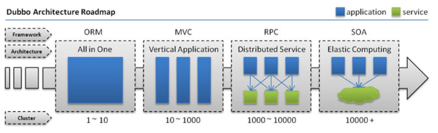
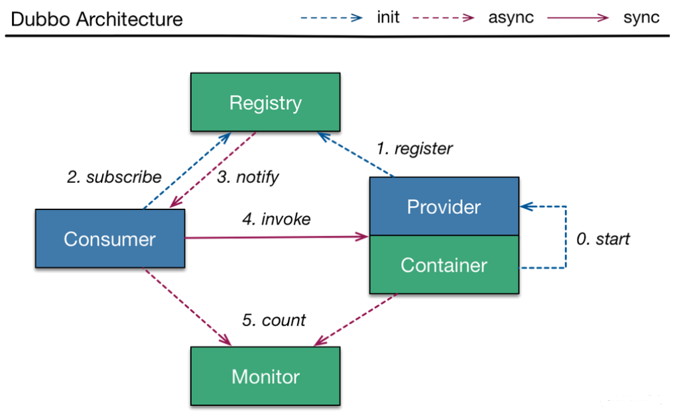
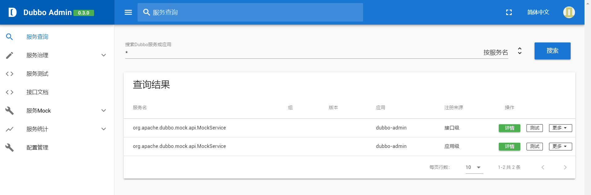

## SpringBoot 分布式系统简单了解

SpringBoot 框架的使用基本是了解的差不多了，马上就进入微服务的阶段了，在此之前必须要了解什么是分布式系统。

### 1. 分布式系统简介

分布式系统（distributed system）是建立在网络之上的软件系统。在《分布式系统原理与范型》书中有分布式系统的定义：“**分布式系统是若干独立计算机的集合，这些计算机对于用户来说就像单个相关系统**”。

分布式系统是由一组通过网络进行通信、为了完成共同的任务而协调工作的计算机节点组成的系统。分布式系统的出现是为了用廉价的、普通的机器完成单个计算机无法完成的计算、存储任务。其目的是利用更多的机器，处理更多的数据。

但是，只有当单个节点的处理能力无法满足日益增长的计算、存储任务的时候，且硬件的提升（加内存、加磁盘、使用更好的CPU）高昂到得不偿失的时候，应用程序也不能进一步优化的时候，才需要考虑分布式系统。因为，分布式系统要解决的问题本身就是和单机系统一样的，而由于分布式系统多节点、通过网络通信的拓扑结构，会引入很多单机系统没有的问题。虽然分布式系统有潜在的问题，但其优点远大于缺点，而且这些缺点也正得到克服。因此，分布式系统仍是人们研究、开发和应用的方向。

#### 1.1 Web应用发展过程

从 Dubbo 应用架构演进图看 Web 应用的发展过程



1. **单一应用架构**：当网站访问量很小时，将所有的功能都部署在一个应用中，可以减少开发和部署的成本。此时，用于简化增删改查工作量的数据访问框架（ORM）是关键。这种方式也有很多的缺点：协同开发较难、性能扩展较难、不利于升级维护。
2. **垂直应用架构**：当网站访问量逐渐增大，单一应用部署的缺点逐渐暴露，此时将应用分解为几个应用，以提高效率。此时，用于加速前端页面开发的 Web 框架（MVC）是关键。这种方式的缺点为：公用模块无法重复利用造成开发的浪费。
3. **分布式服务架构**：当垂直应用越来越多，应用之间的交互不可避免，此时将核心业务抽取出来，作为独立的服务，逐渐形成稳定的服务中心，以使应用能更快速地响应多变的市场需求。此时，用于提高业务复用及整合的**分布式服务框架（RPC）**是关键。
4. **流动计算架构**：当服务越来越多时，容量的评估，小服务资源的浪费等问题逐渐显现，此时需增加一个调度中心基于访问压力实时管理集群容量，提高集群利用率。此时，用于提高机器利用率的资源调度和治理中心（SOA，Service Oriented Architecture）是关键。

#### 1.2 什么是RPC

RPC（Remote Procedure Call），即远程过程调用，是一种进程间的通信方式，它是一种技术的思想，而不是规范。**RPC 的目的是使程序调用另一个地址空间（即不在同一块内存上，通常是共享网络的另一台机器上）的过程或函数，而不用程序员显式编码这个远程调用的细节。**即程序员无论是调用本地的还是远程的函数，本质上编写的调用代码基本相同。

举个例子：现在有两台服务器 A 和 B，其中一个应用部署在 A 上，而 A 的某个业务需要调用 B 上的应用提供的方法，由于两个应用不在同一个地址空间，所以不能直接调用，需要通过网络进行调用和传递数据。而此时 RPC 的作用就是让这个调用过程像调用本地的方法一样，而不用编码其中的具体细节。**RPC 的核心是通讯和序列化。**

> 详细解释什么是 RPC
>
> https://www.jianshu.com/p/2accc2840a1b

### 2. 分布式环境搭建

#### 2.1 Dubbo简介

Apache Dubbo 是一款高性能、轻量级的开源 Java RPC 框架，它具有三大核心功能：面向接口的远程方法调用、智能容错和负载均衡、服务自动注册和发现。

Dubbo 架构图中包含了 Dubbo 的**基本概念**



1. **服务提供者**（Provider）：暴露服务的服务提供方，服务提供者在启动时，向注册中心注册自己提供的服务；
2. **服务消费者**（Consumer）：调用远程服务的服务消费方，服务消费者在启动时，向注册中心订阅自己所需的服务。服务消费者从提供者地址列表中，基于软负载均衡算法，选一台提供者进行调用，如果调用失败，再选另一台调用；
3. **注册中心**（Registry）：注册中心返回服务提供者地址列表给消费者，如果有变更，注册中心将基于长连接推送变更数据给消费者；
4. **监控中心**（Monitor）：服务消费者和提供者，在内存中累计调用次数和调用时间，定时每分钟发送一次统计数据到监控中心。

其中的**调用关系流程**为

1. 服务容器负责启动（0. start），加载，运行服务提供者；
2. 服务提供者在启动时，向注册中心注册（1. register）自己提供的服务；
3. 服务消费者在启动时，向注册中心订阅（2. subscribe）自己所需的服务。
4. 注册中心返回（3. notify）服务提供者地址列表给消费者，如果有变更，注册中心将基于长连接推送变更数据给消费者；
5. 服务消费者，从提供者地址列表中，基于软负载均衡算法，选一台提供者进行调用（4. invoke），如果调用失败，再选另一台调用；
6. 服务消费者和提供者，在内存中累计调用次数和调用时间，定时每分钟发送（5. count）一次统计数据到监控中心。

了解基本概念和调用流程后，可以发现注册中心在分布式服务中扮演了一个中间商的角色，操办起了一整套的分布式服务。因此要使用分布式环境，需要从注册中心开始，Dubbo 官方文档推荐我们使用 ZooKeeper 注册中心。

#### 2.2 ZooKeeper安装

ZooKeeper 是一个[分布式](https://baike.baidu.com/item/分布式/19276232)的，开放源码的[分布式应用程序](https://baike.baidu.com/item/分布式应用程序/9854429)协调服务。它是一个为分布式应用提供一致性服务的软件，提供的功能包括：配置维护、域名服务、分布式同步、组服务等。

ZooKeeper 的目标就是封装好复杂易出错的关键服务，将简单易用的接口和性能高效、功能稳定的系统提供给用户。

1. 在 Windows 中安装 ZooKeeper，可以直接在 https://dlcdn.apache.org/zookeeper/zookeeper-3.7.0/ 下载 ZooKeeper 的已编译版本（带 bin 的），直接解压即可 ；

2. 启动 /bin/zkServer.cmd 以开启服务，但初次启动缺少 zoo.cfg 配置文件，所以没有效果；编辑zkServer.cmd 在最后添加 pause 命令，在启动的时候就可以查看具体信息了；

3. 将 conf 文件夹下的 zoo_sample.cfg 复制一份，命名为 zoo.cfg 就得到了 ZooKeeper 的配置文件，其中的 `dataDir=/tmp/zookeeper` 表示临时数据的存储路径，`clientPort=2181` 表示 ZooKeeper 的端口号；

4. 此时打开先打开服务端 zkServer.cmd，没有闪退表明开启成功，再开启客户端 zkCli.cmd，其中出现 `[zk: localhost:2181(CONNECTED) 0]` 表明连接成功；

5. 使用 `ls /` 命令展示出所有节点：

   ```cmd
   [zk: localhost:2181(CONNECTED) 0] ls /
   [zookeeper]
   ```

6. 使用 `create –e /qiyuan 723` 命令创建一个节点，名字为 qiyuan，值为 723：

   ```cmd
   [zk: localhost:2181(CONNECTED) 1] create -e /qiyuan 723
   Created /qiyuan
   [zk: localhost:2181(CONNECTED) 2] ls /
   [qiyuan, zookeeper]
   ```

7. 使用 `get /qiyuan` 命令查看节点的信息：

   ```cmd
   [zk: localhost:2181(CONNECTED) 3] get /qiyuan
   723
   ```

8. 简单的 ZooKeeper 安装及测试就先完成了！

#### 2.3 Dubbo-Admin安装

Dubbo 本身并不是一个服务软件而是一个 jar 包，能够使 Java 程序连接到 ZooKeeper，并利用 ZooKeeper进行消费或提供服务。

为了让用户更好地管理 Dubbo 中的服务，官方提供了可视化的监控程序 Dubbo-Admin，现在也进行安装。

1. 在 https://github.com/apache/dubbo-admin/tree/master 中下载压缩包并直接解压；

2. 在 dubbo-admin-master\dubbo-admin-server\src\main\resources 目录下的 `application.properties` 文件中可以设置 zookeeper 的端口等（明显的 SpringBoot 项目）；

3. 使用 `mvn clean package -Dmaven.test.skip=true` 命令在项目目录下进行打包，打包完成后，在 dubbo-admin-master\dubbo-admin-server\target 目录下可以找到 dubbo-admin-server-0.3.0 的 jar 包

4. 在 jar 包目录中使用 `java -jar dubbo-admin-server-0.3.0.jar` 命令直接运行 jar 包；

   **已知问题**：若 ZooKeeper 版本为 3.5 以上，则服务端默认使用的端口为 8080，而 Dubbo-Admin 也要使用 8080 端口，所以需要在 zoo.cfg 中添加 `admin.serverPort=``8888` 以修改端口。

5. 开启 Dubbo-Admin 服务后，在 ZooKeeper 服务端打开的情况下访问 localhost:8080 即可进入管理页面，默认用户名和密码都是 root。



这样 Dubbo-Admin 监控服务就安装完成了！

### 3. 总结

从这节开始，就进入分布式服务阶段了，本节也只是进行了一些基础知识的了解和测试环境的搭建，还有很多内容需要学习😵。

> 今天是 2022年1月31日，除夕，新年快乐。
