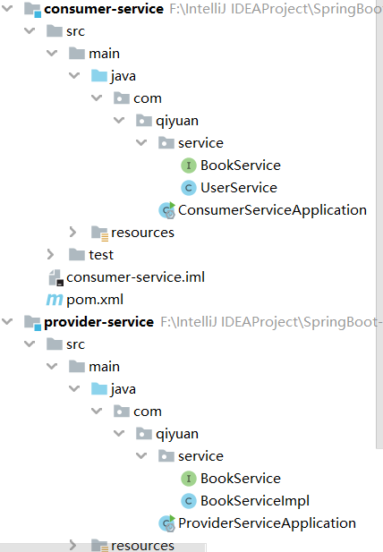
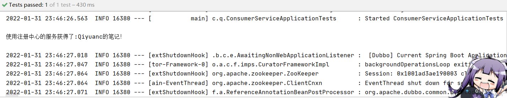
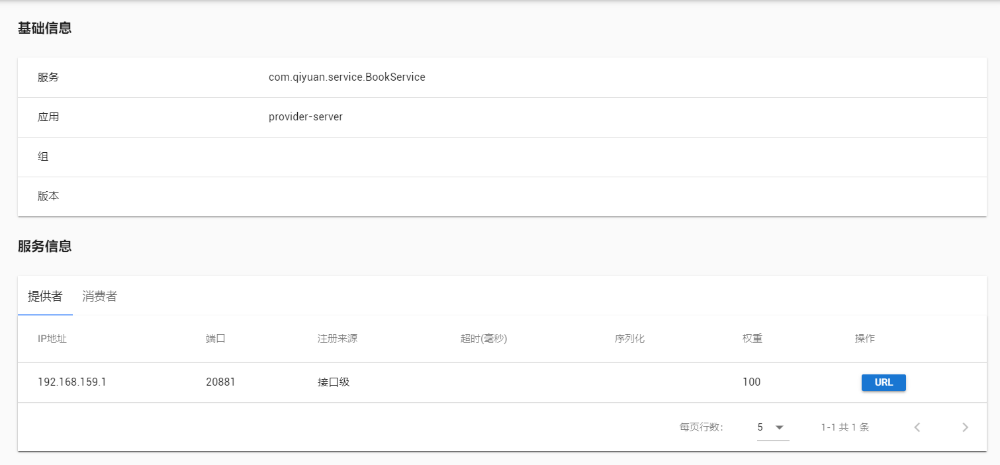

## SpringBoot 分布式系统简单使用

接上节，了解了分布式系统的基本概念和搭建完环境后，用一个简单的例子体验一下分布式服务。

### 1. 环境搭建

创建一个空的新项目，就命名为 SpringBoot-09-DS 吧。

在其中新建 SpringBoot 项目的模块 provider-server，选择 Web 依赖，代表服务提供者。

在其中编写一个卖书的服务，首先是接口

```java
package com.qiyuan.service;

public interface BookService {
    public String getBook();
}
```

然后是接口的实现类

```java
package com.qiyuan.service;

public class BookServiceImpl implements BookService{
    @Override
    public String getBook() {
        return "Qiyuanc的笔记";
    }
}
```

这样服务提供者的服务就完成了，消费者通过 `BookService` 的服务就可以获取到书。

再新建一个 SpringBoot 项目的模块 consumer-server，也只选择 Web 依赖，作为服务消费者，其中只有一个买书的服务

```java
package com.qiyuan.service;

public class UserService {
    // 消费者要去买书！
}
```

现在，需要做的就是通过分布式服务，让 consumer-service 程序能使用 provider-service 程序提供的服务！

### 2. 服务提供者

涉及到分布式服务，要用到 Dubbo 和 ZooKeeper，需要导入相关的依赖

```xml
<dependency>
    <groupId>org.apache.dubbo</groupId>
    <artifactId>dubbo-spring-boot-starter</artifactId>
    <version>2.7.3</version>
</dependency>
<!-- zkclient -->
<dependency>
    <groupId>com.github.sgroschupf</groupId>
    <artifactId>zkclient</artifactId>
    <version>0.1</version>
</dependency>
<!-- zookeeper -->
<dependency>
    <groupId>org.apache.curator</groupId>
    <artifactId>curator-framework</artifactId>
    <version>2.12.0</version>
</dependency>
<dependency>
    <groupId>org.apache.curator</groupId>
    <artifactId>curator-recipes</artifactId>
    <version>2.12.0</version>
</dependency>
<dependency>
    <groupId>org.apache.zookeeper</groupId>
    <artifactId>zookeeper</artifactId>
    <version>3.4.14</version>
    <!-- 排除 slf4j-log4j12 -->
    <exclusions>
        <exclusion>
            <groupId>org.slf4j</groupId>
            <artifactId>slf4j-log4j12</artifactId>
        </exclusion>
    </exclusions>
</dependency>
<dependency>
    <groupId>org.springframework.boot</groupId>
    <artifactId>spring-boot-starter-web</artifactId>
</dependency>

```

导入依赖后，就可以在 SpringBoot 的配置文件 `application.properties` 中进行 dubbo 的属性配置

```properties
#当前应用名字
dubbo.application.name=provider-server
#注册中心地址
dubbo.registry.address=zookeeper://127.0.0.1:2181
#扫描指定包下服务
dubbo.scan.base-packages=com.qiyuan.service
#应用服务 WEB 访问端口
server.port=8001
#为了不和 Dubbo-Admin 冲突 需要换个端口
dubbo.protocol.port=20881 
```

配置完成后，就可以通过 `@Service` 注解将服务发布到注册中心了，注意这个 `@Service` 是 Dubbo 的而不是 Spring 的（在 Dubbo 2.7 之后为了避免冲突换成了 `@DubboService` 注解，但用高版本出问题了，只能老实地用老版！）

```java
package com.qiyuan.service;

import org.apache.dubbo.config.annotation.DubboService;
import org.springframework.stereotype.Service;

// 作为 Dubbo 的服务发布到注册中心
@Service
// 将本类放到 Spring 容器中
@Component
public class BookServiceImpl implements BookService{
    @Override
    public String getBook() {
        return "Qiyuanc的笔记";
    }
}
```

**当应用启动后，Dubbo 会扫描指定的包下带有 `@Service` 注解的服务，将它发布到指定的注册中心中。**

### 3. 服务消费者

与服务提供者一样，服务消费者也需要导入 Dubbo 和 ZooKeeper 相关的依赖。

然后在服务消费者的配置文件中进行配置

```properties
#当前应用名字
dubbo.application.name=consumer-server
#注册中心地址
dubbo.registry.address=zookeeper://127.0.0.1:2181
#应用服务 WEB 访问端口
server.port=8002
```

此时本应将提供者的接口打包，交给消费者以 pom 形式导入，从而使消费者在编程时可以使用提供者的接口。不过为了简单测试，此处直接在消费者中加入需要的接口，该接口路径与提供者中一致即可。



然后就可以在消费者中使用提供者的服务了

```java
package com.qiyuan.service;

import org.apache.dubbo.config.annotation.DubboReference;
import org.springframework.stereotype.Service;

// 交给 Spring
@Service
public class UserService {
    // 消费者要去买书！
    // 远程引用指定的服务，会在注册中心寻找该接口
    @Reference
    BookService bookService;

    public void buyBook(){
        String book = bookService.getBook();
        System.out.println("使用注册中心的服务获得了:"+book+"！");
    }
}
```

在消费者中编写测试类进行测试

```java
@SpringBootTest
class ConsumerServiceApplicationTests {

	@Autowired
	UserService userService;

	@Test
	void contextLoads() {
        // 消费者调用服务者提供的接口去买书！
		userService.buyBook();
	}

}
```

服务开启顺序为

1. 打开 ZooKeeper 注册中心；
2. 打开 Dubbo-Admin 进行监控；
3. 开启服务提供者应用；
4. 开启服务消费者应用，并使用服务！



测试成功（找 BUG 找麻了都）！在 Dubbo-Admin 中也能看到服务提供者提供的接口



简单的分布式服务测试就这样结束了······一会是版本问题，一会是端口问题，折磨的神志不清了。

### 3. 总结

尝试了通过 SpringBoot + Dubbo + ZooKeeper 进行分布式服务的使用，基本的概念和操作还是比较简单的，即通过注册中心使不同的应用能使用网络进行通信，并使用别的应用提供的服务。后续仍需继续深入。