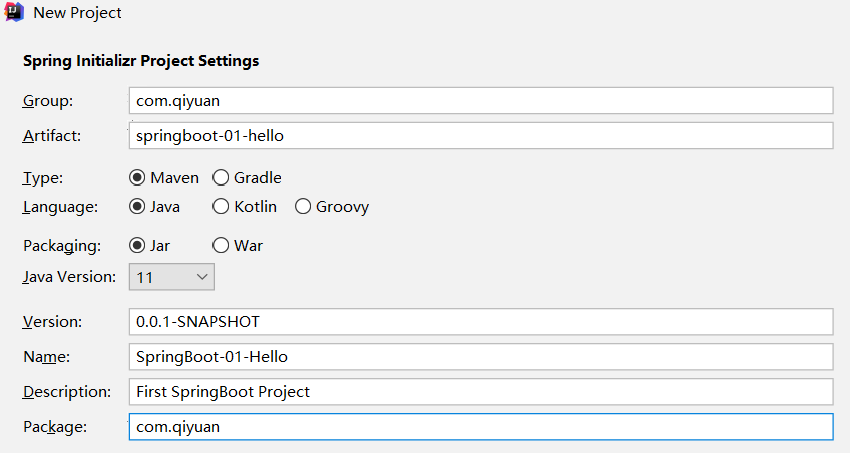
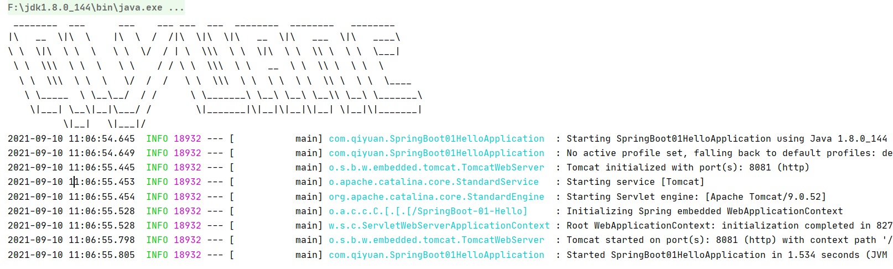

## SpringBoot 初见

摸了几天鱼，还是得回来学习。学会基本的 SSM 框架使用后，就不得不学习一下极大地简化了开发流程的 SpringBoot 了！

### 1. SpringBoot简介

首先回顾一下 Spring 是什么：**Spring是一个轻量级的控制反转( IoC )和面向切面编程( AOP )的框架。**Spring是为了解决企业级应用开发的复杂性而出现的，目的就是为了简化开发。

不过随着 Spring 的发展，集合的东西越来越多，配置也变得更加复杂，此时的 Spring 就背离了简化开发的初衷。因此，SpringBoot 诞生了。

SpringBoot 基于 Spring 开发，其本身并不提供 Spring 框架的核心特性以及扩展功能，只是用于快速、敏捷地开发新一代基于 Spring 框架的应用程序。也就是说，**它并不是用来替代 Spring 的解决方案，而是和 Spring 框架紧密结合用于提升 Spring 开发者体验的工具。**

SpringBoot 框架中有两个非常重要的策略：**开箱即用**和**约定大于配置**。

- **开箱即用**（ Out of Box ），是指在开发过程中，通过在 maven 项目的 pom 文件中添加相关依赖包，然后使用对应注解来代替繁琐的 XML 配置文件以管理对象的生命周期。这个特点使得开发人员摆脱了复杂的配置工作以及依赖的管理工作，更加专注于业务逻辑。
- **约定大于配置**（ Convention over Configuration，CoC ），是一种由 SpringBoot 本身来配置目标结构，由开发者在结构中添加信息的软件设计范式。这一特点虽降低了部分灵活性，增加了 BUG 定位的复杂性，但减少了开发人员需要做出决定的数量，同时减少了大量的 XML 配置，并且可以将代码编译、测试和打包等工作自动化。

总而言之，SpringBoot 并不是新的框架，它只是默认配置了很多框架的使用方式，就像 maven 整合了所有的 jar 包，SpringBoot 整合了所有的框架。

百说不如一用，马上就来写一下第一个 SpringBoot 程序！

### 2. HelloSpringBoot

和之前创建一个父项目不同，这里创建一个 SpringBoot-Study 文件夹，直接用来放小项目！

创建一个 SpringBoot 项目有两种方式

- 使用 Spring Initializr 的 Web页面创建项目：https://start.spring.io/ ，在网站中选择项目配置的信息，获取压缩包后解压用 IDEA 打开即可！
- 使用 IDEA 创建项目，本质上还是用了官网的工具，只是被 IDEA 集成了！此处直接使用 IDEA 更方便点。

在 IDEA 中新建 Spring Initializr 项目，可以看到默认也是使用 Spring 官网的创建工具！进入下一步，要输入项目的 Group 和 Artifact，就是 Maven 的项目坐标（这里不能用大写字母，但下面的名字可以用）！然后选择项目的管理方式（ Maven）、语言（ Java ）、打包方式（ Jar ），最后的 Package 就是项目所属的包，一般留两级即可（如 com.qiyuan ）！



下一步，进入选择项目依赖的 Jar 包环节，一般来说先选择 SpringWeb 即可，不过我还把 Lombok 选上了；再下一步，就是选择项目所在文件夹了，这里就用刚创建的 SpringBoot-Study 文件夹！

最后选择完成，一个 SpringBoot 项目就创建完了，自动开始下载 Jar 包了！

创建完成后可以看到项目的结构，除了熟悉的 src 文件夹和 pom.xml 配置文件，还有一些 mvn 不知道什么用的文件，统统删掉（反正现在用不到看着碍眼）！删完之后的结构真是太熟悉了！

在 com.qiyuan 包下可以看到一个名为 `SpringBoot01HelloApplication` 的类，这就是 SpringBoot 的主启动类了！启动一下，控制台出现 Spring  的 Logo 和五颜六色的信息，就是启动成功了！

现在就可以开始写控制器了，在 com.qiyuan 包下创建 controller，编写 HelloController 类，和之前 SpringMVC 一样！

```java
@Controller
@RequestMapping("/hello")
public class HelloController {
    @RequestMapping("/h1")
    @ResponseBody
    public String Test(){
        return "Hello,World!";
    }
}
```

再次启动 SpringBoot，访问 `localhost:8080/hello/h1`，成功看到 `Hello,Wrold!`！用 SpringBoot 搭建一个项目就是这么简单！

不过由于 SpringBoot 自带了 Tomcat，所以省去了之前给项目配置 Tomcat、设置端口号和项目路径的步骤。不过要是想设置也是可以的，在 resources 目录下可以看到名为 `application.properties` 的配置文件，在其中就可以进行许多配置！

**配置项目端口号和项目路径**

```properties
#项目端口号
server.port=8081
#项目路径
server.servlet.context-path=/SpringBoot-01-Hello
```

这样创建的项目和之前就别无二致了！

### 3. 自定义Banner

在 SpringBoot 中还能自定义启动的 Logo 样式（默认是 Spring 的字符画）！

可以在 https://bootschool.net/ascii 网站寻找或生成字符画

```txt
 ________  ___      ___    ___ ___  ___  ________  ________   ________     
|\   __  \|\  \    |\  \  /  /|\  \|\  \|\   __  \|\   ___  \|\   ____\    
\ \  \|\  \ \  \   \ \  \/  / | \  \\\  \ \  \|\  \ \  \\ \  \ \  \___|    
 \ \  \\\  \ \  \   \ \    / / \ \  \\\  \ \   __  \ \  \\ \  \ \  \       
  \ \  \\\  \ \  \   \/  /  /   \ \  \\\  \ \  \ \  \ \  \\ \  \ \  \____  
   \ \_____  \ \__\__/  / /      \ \_______\ \__\ \__\ \__\\ \__\ \_______\
    \|___| \__\|__|\___/ /        \|_______|\|__|\|__|\|__| \|__|\|_______|
          \|__|   \|___|/                                                  
```

在 resources 目录下创建 banner.txt 文件，将字符画粘贴进去，可以看到文件图标上出现了 SpringBoot 的标志，说明成功被 SpringBoot 识别了！

再次启动 SpringBoot，就能看到效果了



真不错！

### 4. 总结

简单地使用一下 SpringBoot，确实是太简单了。等后面再研究一下它的执行原理吧！
