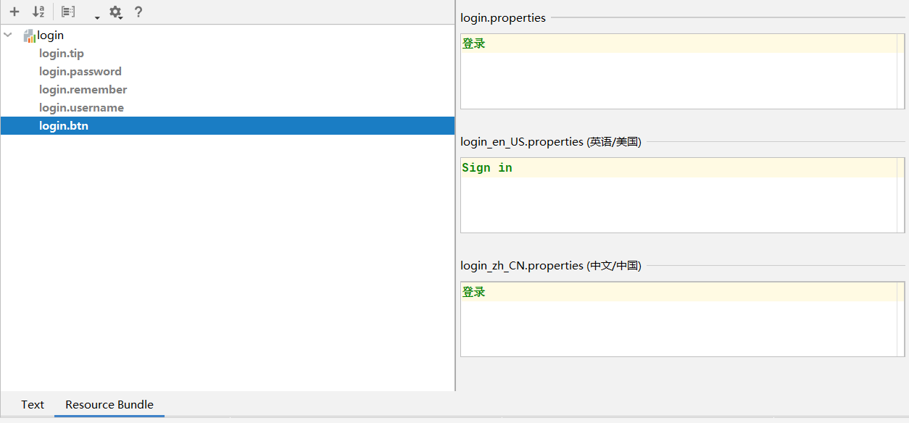

## SpringBoot 员工管理系统①

好久没写 SpringBoot 了···发现还是写算法题有意思，写完就溜不会还能看看答案。不过最后还是得把这个小小项目写一下。

### 1. 准备工作

首先创建个 SpringBoot-04-EMS 项目，不想用之前的项目了，切割一下。创建时添加 Spring Web、Thymeleaf、Lombok 的依赖。

创建完后导入静态资源文件，模板放到 templates 目录下，js、css、img 放到 statics 目录下。这里突然发现 Maven 的路径又被 IDEA 重置了，怪不得导入了好久。

静态资源导入完后，本来应该到数据库的配置阶段了，不过现在先不用数据库，伪造数据库来进行使用。在 com.qiyuan.entity 包下创建部门类 `Department`，充当部门表

```java
@Data
@AllArgsConstructor
@NoArgsConstructor
@ToString
public class Department {
    private Integer id;
    private String departmentName;
}
```

 再创建员工类 `Employee`，充当员工表

```java
@Data
@NoArgsConstructor
@ToString
public class Employee {
    private Integer id;
    private String name;
    private String email;
    private Integer gender; // 0 女 1 男
    private Department department;
    private Date birth;

    public Employee(Integer id, String name, String email, Integer gender, Department department) {
        this.id = id;
        this.name = name;
        this.email = email;
        this.gender = gender;
        this.department = department;
        // 默认创建日期
        this.birth = new Date();
    }
}
```

这样两个实体类就创建完了，它们应该对应数据库中的两张表。

现在编写 Dao 类（若使用 MyBatis 就是 Mapper 类了），在 com.qiyuan.dao 包下创建 `DepartmentDao` 类，在其中用 Map 模拟数据，同时使用了 `@Repository` 注解将这个类交给了 Spring 管理

```java
@Repository
public class DepartmentDao {
    // 用 Map 模拟数据库中的数据，key 就相当于主键了

    private static Map<Integer, Department> departmentMap = null;

    // 静态代码段，类初始化时就加载
    static {
        departmentMap = new HashMap<>();
        departmentMap.put(101,new Department(101,"教学部门"));
        departmentMap.put(102,new Department(102,"市场部门"));
        departmentMap.put(103,new Department(103,"研发部门"));
        departmentMap.put(104,new Department(104,"运营部门"));
        departmentMap.put(105,new Department(105,"后勤部门"));
    }

    // 查询所有部门信息
    public Collection<Department> getDepartments(){
        return departmentMap.values();
    }

    // 通过 id 查询部门
    public Department getDepartmentById(Integer id){
        return departmentMap.get(id);
    }
}
```

再创建 `EmployeeDao` 类，模拟对员工表的操作，同样以 Map 模拟数据，同时引入了 `DepartmentDao` 对象，以获取其中的数据，这一步由 Spring 的自动装配实现！

```java
@Repository
public class EmployeeDao {
    // 用 Map 模拟数据库中的数据，key 就相当于主键了
    private static Map<Integer, Employee> employeeMap = null;

    // 自动装配
    @Autowired
    private static DepartmentDao departmentDao;

    // 静态代码段，类初始化时就加载
    static {
        employeeMap = new HashMap<>();
        employeeMap.put(1001,new Employee(1001,"A","A@email",0,new Department(101,"教学部门")));
        employeeMap.put(1002,new Employee(1002,"B","B@email",1,new Department(102,"市场部门")));
        employeeMap.put(1003,new Employee(1003,"C","C@email",0,new Department(103,"研发部门")));
        employeeMap.put(1004,new Employee(1004,"D","D@email",1,new Department(104,"运营部门")));
        employeeMap.put(1005,new Employee(1005,"E","E@email",0,new Department(105,"后勤部门")));
    }

    // 主键自增
    private static Integer initId = 1006;

    // 增加员工
    public void addEmployee(Employee employee){
        if(employee.getId()==null)
            employee.setId(initId++);
        employee.setDepartment(departmentDao.getDepartmentById(employee.getDepartment().getId()));
        employeeMap.put(employee.getId(),employee);
    }

    // 查询所有员工
    public Collection<Employee> getEmployees(){
        return employeeMap.values();
    }

    // 根据 id 查询员工
    public Employee getEmployeeById(Integer id){
        return employeeMap.get(id);
    }

    // 删除员工
    public void deleteEmployee(Integer id){
        employeeMap.remove(id);
    }
}
```

本来想引用 `DepartmentDao` 中的部门的数据的，但这样运行时会报空指针异常，所以就改成直接创建部门对象的方式了。初步猜测可能是类加载时先于 Spring 的自动装配，导致 `departmentDao` 指针异常。

至此数据库和静态资源就算准备完成了！进入下一步！

### 2. 首页实现

配置首页就是让项目开启时的路径 `/` 设置一个视图，可以通过一个控制器来实现，在 com.qiyuan.controller 包下创建 `IndexController` 类

```java
@Controller
public class IndexController {
    @RequestMapping({"/","/index.html"})
    public String index(){
        return "index";
    }
}
```

这样这个控制器就会将 `/` 和 `/index.html` 的请求返回 `index` 视图，经过视图解析器（此处应该是 Thymeleaf 的视图解析器）解析为 `index.html` 页面。

不过上一节（说是上一节，其实是好久前= =）中学习了 MVC 的配置，我们可以通过配置类自己配置一些 MVC 的操作，首先在 com.qiyuan.config 包下创建 `MyMvcConfig` 类，实现 `WebMvcConfigurer` 接口

```java
@Configuration
public class MyMvcConfig implements WebMvcConfigurer {
    
}
```

然后在其中添加视图解析器，解析 `/` 和 `/index.html` 请求

```java
@Configuration
public class MyMvcConfig implements WebMvcConfigurer {
    @Override
    public void addViewControllers(ViewControllerRegistry registry) {
        registry.addViewController("/").setViewName("index.html");
        registry.addViewController("/index.html").setViewName("index.html");
    }
}
```

这两种方式都能处理请求，因为此处是首页设置，所以采用第二种比较好，第一种的控制器也可以删掉了，不用为首页单独创建一个控制器。

不过这时候打开首页发现加载不出 css 样式（其实是路径的问题），修改路径的同时顺便用 Thymeleaf 的语法修改一下导入的模板文件。

首先在 index.html 文件的头部添加命名空间的引用

```html
<html lang="en" xmlns:th="http://www.thymeleaf.org">
```

然后使用 `th` 命名空间修改其中对 css 样式和 img 图片引用的标签，此处链接改为了 Thymeleaf 的语法 `@{}`

```html
<!-- Bootstrap core CSS -->
<link th:href="@{/css/bootstrap.min.css}" rel="stylesheet">
<!-- Custom styles for this template -->
<link th:href="@{/css/signin.css}" rel="stylesheet">
...

```

修改完后首页的显示就一切正常了！同理，其他几个页面模板的 href 链接也是如此修改，使用 `@{}` 的好处是，如果项目具有项目路径，则 `@{}` 会自动将项目路径加到引用资源的路径上。

此处只用修改本地文件资源的引用，网络资源的引用就不用改了。

### 3. 国际化

常见的网站中，大部分都有中英文切换的功能，在继续完善项目前，先来学习一下怎么进行页面的国际化。

首先在 resources 资源目录下创建一个 i18n 的文件夹（ i18n，internationalization 的缩写），并在其中创建 `login.properties` 文件，创建完这个文件后，再创建一个 `login_zh_CN.properties` 的文件，即中文的配置。

这两个文件都创建完后，IDEA 就会把它们合并到 `Resource Bundle 'login'` 中，此时在上面选择 `Add Property Files to Resource Bundle`，可以看到配置文件与国家地区的对应。再新增一个 `en_US` 的配置，对应英语/美国。此时 `Resource Bundle 'login'` 中就有三个文件了，即默认配置，中文配置，英文配置。

此时进入 IDEA 的 Resource Bundle 窗口，添加一个 Property Key 为 `login.tip`，可以看到出现了三种配置文件对应的输入框，在其中输入该词条对应的内容即可！同理，添加用户名、密码、记住我、登录的中英文对照配置



这样不同语言的内容就配置好了，该如何识别呢？这就要用到 `MessageSourceAutoConfiguration` 自动配置类了，这个类可以通过 `spring.message` 进行定制。在 application.properties 中添加配置

```properties
# 配置文件的 真实位置
spring.messages.basename=i18n.login
```

然后，在要用到信息文本的地方，使用 Thymeleaf 的 `#{}` 获取信息，但取信息的方式在不同标签中是不同的，如

```html
<h1 class="h3 mb-3 font-weight-normal" th:text="#{login.tip}">Please sign in</h1>
<input type="text" class="form-control" th:placeholder="#{login.username}" required="" autofocus="">
<input type="password" class="form-control" th:placeholder="#{login.password}" required="">
<input type="checkbox" value="remember-me"> [[#{login.remember}]]
<button class="btn btn-lg btn-primary btn-block" type="submit">[[#{login.btn}]]</button>
```

**此时再进入首页，显示的就是中文了，且信息是从配置文件中获取的！**

不过现在还没有完成点击按钮切换语言的功能，在了解如何做之前，先了解是如何做到的，在 `WebMvcAutoConfiguration` 类中，有解析地区的方法 `localeResolver()`

```java
public LocaleResolver localeResolver() {
    // 若用户有自己的配置，返回自己的配置
    // 否则用默认的配置 AcceptHeaderLocaleResolver
}
```

其中用到了 `AcceptHeaderLocaleResolver` 地区解析器类，这个类实现了 `LocaleResolver` 接口，所以它就是一个地区解析器

```java
public class AcceptHeaderLocaleResolver implements LocaleResolver
```

也就是说，**我们也可以自己写一个地区解析器，只要实现这个接口就行了！**

先修改前端页面，为选择语言的按钮添加链接

```html
<a class="btn btn-sm" th:href="@{/index.html(lang='zh_CN')}">中文</a>
<a class="btn btn-sm" th:href="@{/index.html(lang='en_US')}">English</a>
```

然后在 com.qiyuan.config 包下创建 `MyLocaleResolver` 类，实现 `LocaleResolver`接口，要求实现两个方法，此处实现返回地区的方法 `resolveLocale` 即可

```java
public class MyLocaleResolver implements LocaleResolver {
    @Override
    public Locale resolveLocale(HttpServletRequest request) {
        // 获取请求中的语言参数
        String language = request.getParameter("lang");
        // 创建一个默认的 locale 对象，没有设置就使用默认的
        Locale locale = Locale.getDefault();
        // 如果获取到了 国际化语言的参数
        if(!StringUtils.isEmpty(language)){
            // 将 zh_CN 分割为语言和地区
            String[] split = language.split("_");
            // 用 语言 和 地区 参数创建 locale 对象
            locale = new Locale(split[0], split[1]);
        }
        return locale;
    }

    @Override
    public void setLocale(HttpServletRequest request, HttpServletResponse response, Locale locale) {

    }
}
```

有了这个地区解析器组件后，就要把它放到 Spring 中，在 `MyMvcConfig` 配置类中把它注册为 Bean

```java
@Configuration
public class MyMvcConfig implements WebMvcConfigurer {
    
    ...

    // 让该组件生效！
    @Bean
    public LocaleResolver localeResolver(){
        return new MyLocaleResolver();
    }
}
```

这样国际化就完成了，可以通过按钮切换页面的语言！

**步骤小结**

1. 配置 i18n 文件对应不同语言的文本
2. 前端页面获取文本中的信息
3. 实现一个地区解析器组件 `LocaleResolver`
4. 将该组件注册到 Spring 中（@Bean）

目前算是开了个头，后面还要继续完善这个项目！
