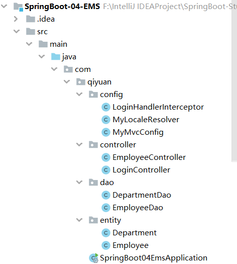

## SpringBoot 员工管理系统③

写完了之前的基本配置和登录模块，就进入 CRUD 环节了，写多了也没意思了，不过在 SpringBoot 中还是第一次写。

### 1. 展示员工列表

要展示员工列表，就要有前端页面的支持了，所以需要先调整一下模板的格式。在这个模板中，页面的顶部栏和侧边栏在不同的页面中是复用的，所以先将它们提取出来，先找到它们的位置

```html
<!--顶部栏-->
<!-- dashborad.html list.html Line 46-54 -->
<nav class="navbar navbar-dark sticky-top bg-dark flex-md-nowrap p-0">
    ...
</nav>
<!--侧边栏-->
<!-- dashborad.html list.html Line 58-179 -->
<nav class="col-md-2 d-none d-md-block bg-light sidebar">
    ...
</nav>
```

在 templates 目录下创建 commons 文件夹，并在其中创建 commons.html 文件，将顶部栏和侧边栏的组件代码放进去，同时为它们**设置 `th:fragment` 属性，让其他页面可以引用这些组件**

```html
<!DOCTYPE html>
<html lang="en" xmlns:th="http://www.thymeleaf.org">

<!--顶部栏-->
<nav class="navbar navbar-dark sticky-top bg-dark flex-md-nowrap p-0" th:fragment="topbar">
    ...
</nav>

<!--侧边栏-->
<nav class="col-md-2 d-none d-md-block bg-light sidebar" th:fragment="sidebar">
    ...
</nav>

</html>
```

然后在用到这两个组件的页面中，改为从 commons.html 中获取

```html
<!-- dashborad.html list.html Line 46 -->
<div th:replace="~{commons/commons::topbar}"></div>
<!-- dashborad.html list.html Line 50 -->
<div th:replace="~{commons/commons::sidebar}"></div>
```

这样一来，用到这两个组件的页面的代码量变少了许多，而且要修改的时候，只需要修改 commons.html 中的内容即可！

接下来调整前端的员工管理页面的入口，将侧边栏上的标签改为员工管理，并为其设置一个请求 `/list`

```html
<li class="nav-item">
    <a class="nav-link" th:href="@{/list}">
        <svg>...</svg>
        员工管理
    </a>
</li>
```

有了请求自然需要控制器去处理请求，创建 `EmployeeController` 类，在其中处理这个请求

```java
@Controller
public class EmployeeController {

    // 没有 Service 层，先用 Dao 层凑个数
    @Autowired
    private EmployeeDao employeeDao;

    // 查询所有员工
    @RequestMapping("/list")
    public String getAllEmployeesList(Model model){
        Collection<Employee> employees = employeeDao.getEmployees();
        model.addAttribute("emps",employees);
        return "emp/list";
    }
}
```

此处返回的是 templates 目录下的 emp 目录中的 list.html，emp 目录表示其中内容是和员工相关的，在项目涉及数据多的时候，针对不同的内容就需要分类（当然这里只是演示）！ 

此时在主页点击员工管理，就会跳转到 list.html 页面了，当然因为没有传输数据，所以显示的都是演示数据。不过又有一个小问题，点击员工管理进入 list.html 页面后，侧边栏的员工管理并没有亮起来，这当然是不合适的，不过现在还没进入正题，这个还是先跳过吧（ P25 15:00 ）。

为了让前端页面正常显示获得的数据，还要调整页面上表单的格式，这一步就没什么难度了

```html
<main role="main" class="col-md-9 ml-sm-auto col-lg-10 pt-3 px-4">
    <h2>员工列表</h2>
    <div class="table-responsive">
        <table class="table table-striped table-sm">
            <thead>
                <tr>
                    <th>ID</th>
                    <th>名字</th>
                    <th>邮箱</th>
                    <th>性别</th>
                    <th>部门</th>
                    <th>日期</th>
                    <th>操作</th>
                </tr>
            </thead>
            <tbody>
                <tr th:each="emp:${emps}">
                    <td th:text="${emp.getId()}"></td>
                    <!--这种方式也能取值-->
                    <td>[[ ${emp.getName()} ]]</td>
                    <td th:text="${emp.getEmail()}"></td>
                    <!--性别用三元表达式判断-->
                    <td th:text="${emp.getGender()==0?'女':'男'}"></td>
                    <td th:text="${emp.getDepartment().getDepartmentName()}"></td>
                    <!--用日期工具进行日期的格式转换-->
                    <td th:text="${#dates.format(emp.getBirth(),'yyyy-MM-dd')}"></td>
                    <td>
                        <button class="btn btn-sm btn-primary">编辑</button>
                        <button class="btn btn-sm btn-danger">删除</button>
                    </td>
                </tr>
            </tbody>
        </table>
    </div>
</main>
```


获取后端在模型中存放的 emps 集合，对其进行遍历就能获取里面的所有元素了，针对不同的元素采用不同的显示方式。这样展示员工页面就算完成了，同时还给添加了编辑和删除的按钮，后面继续完善业务！

### 2. 增加员工实现

要增加员工，就需要一个对应的增加页面 add.html，同时在列表中要加上一个按钮跳转过去。先增加按钮，在员工列表标题下面增加（其实是我不知道怎么放右边去😥）

```html
<p>
    <h2>员工列表</h2>
    <a class="btn btn-sm btn-success" th:href="@{/toAdd}">添加员工</a>
</p>
```

然后将 list.html 复制一份放到 emp 目录下，命名为 add.html，将它修改为增加页面

```html
<main role="main" class="col-md-9 ml-sm-auto col-lg-10 pt-3 px-4">
    <form th:action="@{/addEmployee}" method="post">
        <div class=form-group>
            <lable>Name</lable>
            <input type=text class=form-control name=lastName>
        </div>
        <div class=form-group>
            <lable>Email</lable>
            <input type=email class=form-control name=email>
        </div>
        <div class=form-group>
            <lable>Gender</lable>
            <div class=form-check form-check-inline>
                <input class=form-check-input type=radio name=gender value=1>
                <lable class=form-check-label>男</lable>
            </div>
            <div class=form-check form-check-inline>
                <input class=form-check-input type=radio name=gender value=0>
                <lable class=form-check-label>女</lable>
            </div>
        </div>
        <div class=form-group>
            <label>department</label>
            <select class=form-control name=department.id>
                <option th:each="dept:${departments}" 
                        th:text="${dept.getDepartmentName()}" th:value="${dept.getId()}"></option>
            </select>
        </div>
        <div class=form-group>
            <label>Birth</label>
            <input type=text class=form-control name=birth placeholder=2020-5-22>
        </div>
        <button type=submit class=btn btn-primary>添加</button>
    </form>
</main>
```

再到 `EmployeeController` 中添加一个方法，处理 `/toAdd` 请求，跳转到增加页面，由于添加时需要选择部门，所以 add.html 页面还需要获取所有部门的信息，也要在该方法中处理

```java
@Controller
public class EmployeeController {
    ...

    @Autowired
    private DepartmentDao departmentDao;
    
    // 跳转到增加员工页面
    @RequestMapping("/toAdd")
    public String toAddPage(Model model){
        Collection<Department> departments = departmentDao.getDepartments();
        model.addAttribute("departments",departments);
        return "emp/add.html";
    }
}
```

这样增加页面在显示上就没有问题了


其中日期的格式为 `yyyy-MM-dd`，但默认格式应该是 `yyyy/MM/dd`，所以需要在 SpringBoot 的配置文件中对其进行配置，在 `application.properties` 中添加

```properties
spring.mvc.format.date=yyyy-MM-dd
```

这样输入日期的格式就是 `yyyy-MM-dd` 了！

**注意：**遇到了一个折磨了半天的 BUG，先说结果，SpringBoot 不能直接对类中的静态成员变量进行自动装配，就是由于之前在 `EmployeeDao` 中，自动装配了 `DepartmentDao`（为空），导致在从中获取部门信息时报空指针异常。感谢 https://www.cnblogs.com/xdaniel/p/14920861.html 的指导。

这样增加员工功能就实现了，**因为 SpringBoot 有参数解析器，能将我们表单提交的参数对应到控制器中的参数去，所以我们只要做好表单参数与控制器参数的对应就可以了！**

### 3. 修改员工信息

继续完善之前添加的修改按钮的功能，先将之前添加的 `button` 标签改为 `a` 标签，并设置发起的请求，此处使用了 REST 风格

```html
<a class="btn btn-sm btn-primary" th:href="@{'/toUpdate/'+${emp.getId()}}">编辑</a>
```

这样就能通过这个按钮发起 `/toUpdate` 请求了，因为修改页面要先显示员工的信息，所以携带参数为需要修改的员工的 ID 以查询对应的信息。在控制器中添加方法 `toUpdatePage`

```java
@Controller
public class EmployeeController {

    @Autowired
    private EmployeeDao employeeDao;
    
    ...

    // 跳转到修改员工页面，路径为 REST 风格
    @RequestMapping("/toUpdate/{id}")
    public String toUpdatePage(@PathVariable("id") Integer id, Model model){
        // 查询要修改的员工的信息
        Employee employee = employeeDao.getEmployeeById(id);
        // 放到模型中，给前端页面显示
        model.addAttribute("emp",employee);
        // 部门信息也要带上
        Collection<Department> departments = departmentDao.getDepartments();
        model.addAttribute("departments",departments);
        return "emp/update";
    }
}
```

然后和之前一样，将 add.html 复制一份，改为 update.html，**区别在于修改页面要预先显示之前的数据，且修改还要携带 ID，放在隐藏域中**

```html
<main role="main" class="col-md-9 ml-sm-auto col-lg-10 pt-3 px-4">
    <form th:action="@{/updateEmployee}" method="post">
        <!-- 修改要带上 ID！放在隐藏域中！ -->
        <input type="hidden" name="id" th:value="${emp.getId()}">
        <div class=form-group>
            <!--用 th:value 设置值-->
            <lable>Name</lable>
            <input th:value="${emp.getName()}" type=text class=form-control name=name>
        </div>
        <div class=form-group>
            <lable>Email</lable>
            <input th:value="${emp.getEmail()}" type=email class=form-control name=email>
        </div>
        <div class=form-group>
            <!--选项的用 th:checked 进行检查-->
            <lable>Gender</lable>
            <div class=form-check form-check-inline>
                <input th:checked="${emp.getGender()==1}" class=form-check-input type=radio name=gender value=1>
                <lable class=form-check-label>男</lable>
            </div>
            <div class=form-check form-check-inline>
                <input th:checked="${emp.getGender()==0}" class=form-check-input type=radio name=gender value=0>
                <lable class=form-check-label>女</lable>
            </div>
        </div>
        <div class=form-group>
            <label>department</label>
            <select class=form-control name=department.id>
                <!--遍历部门，选中员工的部门-->
                <option th:selected="${dept.getId()==emp.getDepartment().getId()}" th:each="dept:${departments}"
                        th:text="${dept.getDepartmentName()}" th:value="${dept.getId()}"></option>
            </select>
        </div>
        <div class=form-group>
            <label>Birth</label>
            <!--用日期工具 改变日期的格式！-->
            <input th:value="${#dates.format(emp.getBirth(),'yyyy-MM-dd')}" type=text class=form-control name=birth placeholder=2020-5-22>
        </div>
        <button type=submit class=btn btn-primary>修改</button>
    </form>
</main>
```

最后是处理修改请求的方法 `updateEmployee`

```java
@Controller
public class EmployeeController {

    @Autowired
    private EmployeeDao employeeDao;
    
    ...

    @RequestMapping("/updateEmployee")
    public String updateEmployee(Employee employee){
        // 直接使用 add 的原因是数据库其实是个 Map
        // add 时若 Key 即 ID 已存在，则会对应到这个新的上面来
        employeeDao.addEmployee(employee);
        return "redirect:/list";
    }
}
```

此处可以直接使用 add 的方法，原因是伪造的数据库是 Map，只要 Key 即 ID 是相同的，在 put 时相当于为 Key 指定了另一个 Value，有点歪门邪道。

这样修改功能也完成了！

### 4. 删除及错误处理

比起增加和修改，删除真的是最简单的了。删除不用涉及表单的提交（至少现在是这样），只需要发起一个请求，携带要删除的对象的 Key 即可。

将之前加的删除的按钮的 `button` 改为 `a` 标签，并设置请求地址

```html
<a class="btn btn-sm btn-danger" th:href="@{'/delete/'+${emp.getId()}}">删除</a>
```

在控制器中添加一个方法处理删除的请求

```java
@Controller
public class EmployeeController {

    @Autowired
    private EmployeeDao employeeDao;
    
    ...

    @RequestMapping("/delete/{id}")
    public String deleteEmployee(@PathVariable Integer id){
        employeeDao.deleteEmployee(id);
        return "redirect:/list";
    }
}
```

这样删除就完成了，嗯，就是这么简单。

搞完了 CRUD，再**设置一下页面的报错处理**。在 SpringBoot 中，设置报错的跳转页面非常简单：只需要在 templates 目录下创建 error 目录，在其中放入对应的错误页面如 404.html、500.html 即可，在出错时 SpringBoot 会自动去这个目录下寻找对应的错误页面！

最后展示一下项目的结构吧




第一个还算能看一点点的小项目就这么完成了。

> ***人类的热闹各不相同，但孤独的底色大致相通。***

