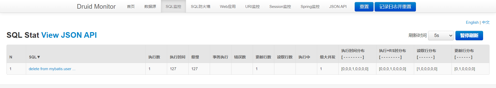

## SpringBoot 使用Druid数据源

程序进行数据库操作的时候，需要使用数据库连接，而数据库连接的性能又与数据库连接池不无关系。Druid 是阿里巴巴开源的一个数据库连接池的实现，结合了 C3P0、DBCP 等数据库连接池的优点，同时加入了日志监控。Druid 的强大之处在于其在监控上的应用，它能很好地监控数据库连接池和 SQL 的执行情况。

在 SpringBoot 中使用 JDBC 时可以看到，它默认的数据源是 Hikari 数据源。Hikari 和 Druid 都是 JavaWeb 中最优秀的数据源。现在来尝试在 SpringBoot 中集成 Druid 数据源！

### 1. 配置数据源

直接去 Maven 仓库捞一个 Druid 的依赖，这里我使用 SpringBoot-Starter 版的

```xml
<!-- Druid -->
<dependency>
    <groupId>com.alibaba</groupId>
    <artifactId>druid-spring-boot-starter</artifactId>
    <version>1.2.6</version>
</dependency>
```

然后在 application.yaml 中配置数据源，具体为 datasource 的 type 属性

```yaml
spring:
  datasource:
    username: root
    password: '0723'
    # serverTimezone=UTC 解决时区问题
    url: jdbc:mysql://localhost:3306/mybatis?serverTimezone=UTC&useUnicode=true&characterEncoding=utf-8
    # mysql8 以上使用 cj
    driver-class-name: com.mysql.cj.jdbc.Driver
    type: com.alibaba.druid.pool.DruidDataSource
```

然后就配置完了，就这样。直接去测试一下，还是之前那个测试程序，查看数据源和获取到的连接

```java
@SpringBootTest
class SpringBoot05DataApplicationTests {

    // 自动装配数据源
    @Autowired
    DataSource dataSource;

    @Test
    void contextLoads() throws SQLException {
        // 查看数据源 ：class com.alibaba.druid.spring.boot.autoconfigure.DruidDataSourceWrapper
        System.out.println(dataSource.getClass());
        // 获得数据库连接
        Connection connection = dataSource.getConnection();
        // 查看获得的连接 com.mysql.cj.jdbc.ConnectionImpl@2d3ef181
        System.out.println(connection);
        connection.close();
    }

}
```

可以看到，数据源已经变成 Druid 了，不过数据库连接仍是 JDBC 的，说明不论什么数据源，其底层都是 JDBC！

然后在 yaml 中就可以对 Druid 进一步进行配置，如（此处使用了 log4j，故需要导入 log4j 的依赖，否则会报错）

```yaml
type: com.alibaba.druid.pool.DruidDataSource
#druid 数据源专有配置
druid:
    initialSize: 5
    minIdle: 5
    maxActive: 20
    maxWait: 60000
    timeBetweenEvictionRunsMillis: 60000
    minEvictableIdleTimeMillis: 300000
    validationQuery: SELECT 1 FROM DUAL
    testWhileIdle: true
    testOnBorrow: false
    testOnReturn: false
    poolPreparedStatements: true
    #配置监控统计拦截的filters，stat:监控统计 log4j:日志记录 wall:防御sql注入
    filters: stat,wall,log4j
    maxPoolPreparedStatementPerConnectionSize: 20
    useGlobalDataSourceStat: true
    connectionProperties: druid.stat.mergeSql=true;druid.stat.slowSqlMillis=500
```

配置完后去执行之前 JDBCController 中的操作，并不会发生什么变化，因为最底层都是 JDBC 的实现！但运行测试连接的方法，可见

```java
@SpringBootTest
class SpringBoot05DataApplicationTests {

    // 自动装配数据源
    @Autowired
    DataSource dataSource;

    @Test
    void contextLoads() throws SQLException {
        // 查看数据源 ：class com.alibaba.druid.spring.boot.autoconfigure.DruidDataSourceWrapper
        System.out.println(dataSource.getClass());
        // 获得数据库连接
        Connection connection = dataSource.getConnection();
        // 查看获得的连接 com.alibaba.druid.proxy.jdbc.ConnectionProxyImpl@75b6dd5b
        System.out.println(connection);
        DruidDataSource druidDataSource = (DruidDataSource) dataSource;
        System.out.println("druidDataSource 数据源最大连接数：" + druidDataSource.getMaxActive());
        System.out.println("druidDataSource 数据源初始化连接数：" + druidDataSource.getInitialSize());
        connection.close();
    }

}
/*
class com.alibaba.druid.spring.boot.autoconfigure.DruidDataSourceWrapper
com.alibaba.druid.proxy.jdbc.ConnectionProxyImpl@75b6dd5b
druidDataSource 数据源最大连接数：20
druidDataSource 数据源初始化连接数：5
*/
```

可见配置已经生效！

除了在全局配置文件中指定 druid 的属性配置外，也可以通过创建 DruidConfig 类，将配置文件中的属性注入到 com.alibaba.druid.pool.DruidDataSource 的同名参数中，具体在下面尝试。

### 2. 配置监控

上面简单地配置了 Druid 数据源和它的一些属性，但这些工作其他数据源也能做到。现在来尝试使用一下 Druid 的监控功能，也是其真正强大的地方。

要进行 Druid 的相关配置，需要在 com.qiyuan.config 包下创建 DruidConfig 类，同时将其注解为配置类，并且与 yaml 配置文件中的属性绑定

```java
@Configuration
public class DruidConfig {
    /*
       @ConfigurationProperties(prefix = "spring.datasource") 作用就是将 全局配置文件中
       前缀为 spring.datasource.druid的属性值注入到 com.alibaba.druid.pool.DruidDataSource 的同名参数中
     */
    // 其实在 yaml 中可以直接 spring.datasource.druid，即上面。我为啥要这样搞？
    @ConfigurationProperties(prefix = "spring.datasource")
    @Bean
    public DataSource druidDataSource() {
        return new DruidDataSource();
    }
}
```

然后是设置 Druid 的后台管理页面，需要在 SpringBoot 中注册一个 Servlet，相当于以前在 web.xml 中配置 Servlet 的步骤了

```java
@Configuration
public class DruidConfig {
    
    ...

    // SpringBoot 内置了 Servlet 容器，这个方法就是在 web.xml 中注册 Servlet 的替代！
    @Bean
    public ServletRegistrationBean statViewServlet(){
        ServletRegistrationBean bean = new ServletRegistrationBean(new StatViewServlet(), "/druid/*");
        Map<String,String> initParams = new HashMap<>();
        // 设置后台界面的登录账号和密码，key 是固定的
        initParams.put("loginUsername","qiyuanc");
        initParams.put("loginPassword","0723");
        // 设置允许访问的对象
        initParams.put("allow","");
        // 设置禁止访问的对象
        //initParams.put("deny","192.168.1.1");

        bean.setInitParameters(initParams);
        return bean;
    }
}
```

在 DruidConfig 中配置好页面的 Servlet 后，就可以通过 `localhost：8080/druid` 进入 Druid 的首页了，按照设置好的用户名密码登录，就可以看到其中有很多花里胡哨的功能！


进入 SQL 监控界面，再执行之前的 JDBCController 中的 SQL 测试，可以看到具体的监控报告！



属实是非常厉害了！

除此之外，还可以配置 Web 和 Druid 数据源之间的管理关联监控统计 WebStatFilter，和上面注册 Servlet 类似，注册一个过滤器即可

```java
@Configuration
public class DruidConfig {
    
    ...

    @Bean
    public FilterRegistrationBean webStatFilter(){
        FilterRegistrationBean bean = new FilterRegistrationBean();
        bean.setFilter(new WebStatFilter());
        Map<String, String> initParams = new HashMap<>();
        // exclusions 设置哪些请求不用过滤，从而不进行统计
        initParams.put("exclusions", "*.js,*.css,/druid/*,/jdbc/*");
        bean.setInitParameters(initParams);
        return bean;
    }
}
```

具体作用还不知道，反正知道 **SpringBoot 中也可以进行 Servlet 和 Filter 的配置就行了**！

### 3. 总结

尝试使用了一下 Druid 数据源，它自带的网页监控的功能配置简单，功能强大，确实是非常好用。同时尝试在 SpringBoot 中进行 Servlet 和 Filter 的配置，梦回半年前。