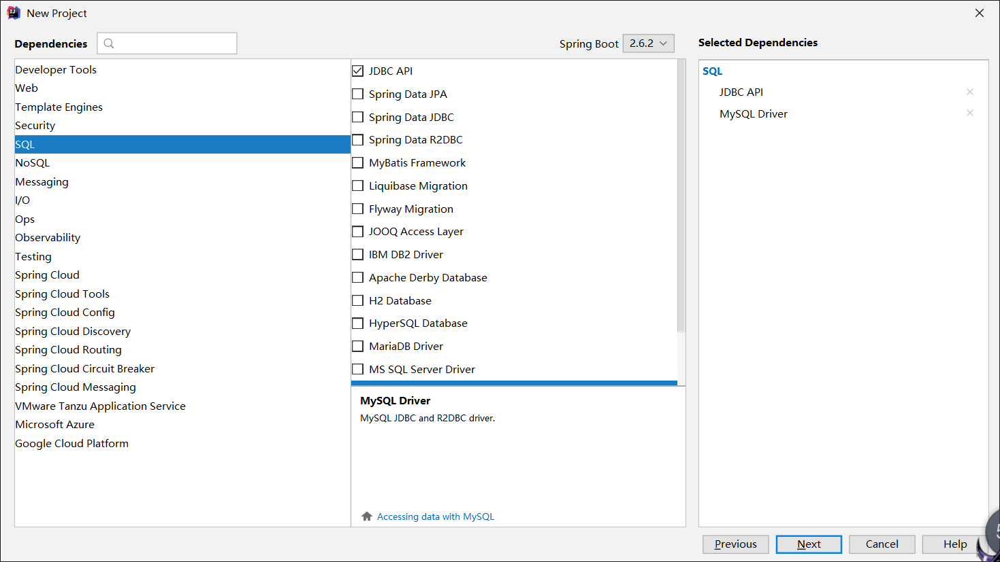

## SpringBoot 使用JDBC

我超，又要开始了。太久不写，全忘完了，就当 Remake 了！

### 1. 使用JDBC

SringBoot 对数据层进行访问，无论是 SQL（关系型数据库）还是 NoSQL（非关系型数据库），其底层都是采用 Spring Data 的方式进行处理的。

按照之前的笔记，创建 SpringBoot-05-Data 项目，然后添加数据相关的依赖，先只添加基础的 JDBC API 和 MySQL Driver，学习一下。



进入项目，查看 pom.xml 文件，可以看到依赖

```xml
<dependencies>
    <!-- JDBC -->
    <dependency>
        <groupId>org.springframework.boot</groupId>
        <artifactId>spring-boot-starter-jdbc</artifactId>
    </dependency>
    <!-- MYSQL -->
    <dependency>
        <groupId>mysql</groupId>
        <artifactId>mysql-connector-java</artifactId>
        <scope>runtime</scope>
    </dependency>
</dependencies>
```

然后在 resources 目录下创建 `application.yaml` 文件（自带 properties 文件，但这里我们使用 yaml 文件），添加连接数据库的信息

```yaml
spring:
  datasource:
    username: root
    password: '0723'
    # serverTimezone=UTC 解决时区问题
    url: jdbc:mysql://localhost:3306/mybatis?serverTimezone=UTC&useUnicode=true&characterEncoding=utf-8
    # mysql8 以上使用 cj
    driver-class-name: com.mysql.cj.jdbc.Driver
```

因为 SpringBoot 自动装配的特性，导入 JDBC 的依赖且在 yaml 中配置好对应的后，它就会直接为我们生成对应的对象，在 test 中直接输出查看一下

```java
@SpringBootTest
class SpringBoot05DataApplicationTests {

    // 自动装配数据源
    @Autowired
    DataSource dataSource;

    @Test
    void contextLoads() {
        // 查看默认的数据源 ：class com.zaxxer.hikari.HikariDataSource
        System.out.println(dataSource.getClass());
    }

}
```

然后尝试利用数据源创建连接，同时查看一下连接

```java
@SpringBootTest
class SpringBoot05DataApplicationTests {

    // 自动装配数据源
    @Autowired
    DataSource dataSource;

    @Test
    void contextLoads() throws SQLException {
        // 查看默认的数据源 ：class com.zaxxer.hikari.HikariDataSource
        System.out.println(dataSource.getClass());
        // 获得数据库连接
        Connection connection = dataSource.getConnection();
        // 查看获得的连接 HikariProxyConnection@354350463 wrapping com.mysql.cj.jdbc.ConnectionImpl@10895b16
        // 是 JDBC 的连接！
        System.out.println(connection);
        connection.close();
    }

}
```

> 这里遇到了一个逆天问题，即使用 yaml 文件连接数据库的话，纯数字密码要带上单引号，否则会连接失败。上面的 yaml 文件是修改后的，小折磨了一下。

如此，在 SpringBoot 中就成功获取到 JDBC 的连接了！就可以通过 JDBC 连接操作数据库了······都到 SpringBoot 了谁还用 JDBC！

但这还不够，再去小小地看一下源码，从 yaml 的配置属性如 username 点进去，进到了 DataSourceProperties 类！其中可以看到数据源可以配置的所有属性

```java
@ConfigurationProperties(
    prefix = "spring.datasource"
)
public class DataSourceProperties implements BeanClassLoaderAware, InitializingBean {
    private ClassLoader classLoader;
    private boolean generateUniqueName = true;
    private String name;
    private Class<? extends DataSource> type;
    private String driverClassName;
    private String url;
    private String username;
    private String password;
    private String jndiName;
    
    ...
        
}
```

回忆一下，在 SpringBoot 中，有 xxxProperties 类，就会有与之对应的 xxxAutoConfiguration 类！使用 Ctrl+N 全局搜索，可以搜索到 DataSourceAutoConfiguration 类！

```java
@Configuration(
    proxyBeanMethods = false
)
// 自动配置
@ConditionalOnClass({DataSource.class, EmbeddedDatabaseType.class})
@ConditionalOnMissingBean(
    type = {"io.r2dbc.spi.ConnectionFactory"}
)
// 绑定了 DataSourceProperties 
@EnableConfigurationProperties({DataSourceProperties.class})
// 导入...忘了
@Import({DataSourcePoolMetadataProvidersConfiguration.class, InitializationSpecificCredentialsDataSourceInitializationConfiguration.class, SharedCredentialsDataSourceInitializationConfiguration.class})
public class DataSourceAutoConfiguration {
    
    ...
    
}
```

呃，到这里就回忆起点东西来了，不过源码就不继续深入了。**总之，通过在 yaml 文件中对数据源 datasource 进行配置，SpringBoot 就能获取到这些配置然后创建数据源，当然，不要忘记导入相关的包。**

### 2. JDBCTemplate

有了数据源（Hikari）后，可以获取到数据库连接（JDBC Connection），就可以使用原生的 JDBC 对数据库进行操作了。即使不使用额外的数据库操作框架如 MyBatis，SpringBoot 也对原生的 JDBC 进行了轻量的封装，从而产生了 JDBCTemplate。

JDBCTemplate 的自动配置依赖于 org.springframework.boot.autoconfigure.jdbc 下的 JdbcTemplateConfiguration 类。

```java
@Configuration(
    proxyBeanMethods = false
)
@ConditionalOnMissingBean({JdbcOperations.class})
class JdbcTemplateConfiguration {
    JdbcTemplateConfiguration() {
    }

    @Bean
    @Primary
    JdbcTemplate jdbcTemplate(DataSource dataSource, JdbcProperties properties) {
        ...
        return jdbcTemplate;
    }
}
```

数据库操作的 CRUD 方法都封装在了 JDBCTemplate 中，且 SpringBoot 已经将其配置好放入容器中，我们只需要获取然后使用即可！

在 com.qiyuan 下创建 controller 包，并在其中创建 JDBCController 类使用一下 JDBCTemplate。此处出错：之前创建项目的时候忘记加入 web 相关的包了，导致 SpringMVC 注解无法使用。

```java
// 复习：返回 JSON 字符串，不经过视图解析器
@RestController
public class JDBCController {

    // 已经配置好了，直接拿过来用
    @Autowired
    JdbcTemplate jdbcTemplate;

    // 查询数据库的所有信息
    // 还没写实体类，怎么获取数据库中的对象？使用 Map！
    @GetMapping("/userList")
    public List<Map<String,Object>> userList(){
        // 查询 user 表的所有信息
        String sql = "select * from user";
        List<Map<String, Object>> list_maps = jdbcTemplate.queryForList(sql);
        return list_maps;
    }

    @GetMapping("/addUser")
    public String addUser(){
        String sql = "insert into mybatis.user(id,name,pwd) values (4,'qiyuanb','123456')";
        jdbcTemplate.update(sql);
        return "add-ok";
    }

    // 用一下 RestFul 风格
    @GetMapping("/updateUser/{id}")
    public String updateUser(@PathVariable("id")int id){
        // 预编译，需要传参数
        String sql = "update mybatis.user set name=?,pwd=? where id="+id;
        Object object[] = new Object[2];
        object[0]="qiyuanc";
        object[1]="0823";
        jdbcTemplate.update(sql,object);
        return "update-ok";
    }
    @GetMapping("/deleteUser/{id}")
    public String deleteUser(@PathVariable("id")int id){
        String sql = "delete from mybatis.user where id=?";
        jdbcTemplate.update(sql,id);
        return "delete-ok";
    }
}
```

测试完全成功，到这里简单的 SpringBoot 使用 JDBC 操作就结束了！同时复习了控制器 Controller 的操作、RestFul 风格、预编译 SQL 等知识。

### 3. 总结

由于 SpringBoot 将 JDBC 的操作封装了起来成为 JDBCTemplate，使得我们即使直接使用 JDBC 对数据库进行操作也没有以前那么麻烦了。不过既然有更好用的 MyBatis，还是要用更好的。

