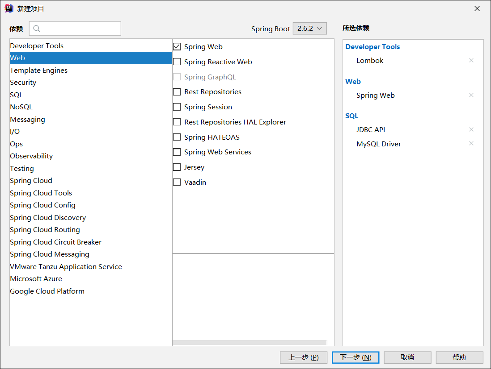

## SpringBoot 整合MyBatis

了解完 SpringBoot 中简单的 JDBC 使用操作后，就可以尝试将 SpringBoot 与 MyBatis 结合起来了。

### 1. 导入MyBatis依赖

新建项目 SpringBoot-06-MyBatis，添加 Spring Web 、JDBC API 和 MySQL Driver 的依赖（顺便把 Lombok 也加上了）.



然后和之前一样配置数据源并测试连接，为了后面的使用，这次用 properties 文件进行配置

```properties
# properties 配置
spring.datasource.username=root
spring.datasource.password=0723
spring.datasource.url=jdbc:mysql://localhost:3306/mybatis?serverTimezone=UTC&useUnicode=true&characterEncoding=utf-8
spring.datasource.driver-class-name=com.mysql.cj.jdbc.Driver
```

接着在测试方法中尝试获取连接，若成功输出则说明连接数据库成功

```java
@SpringBootTest
class SpringBoot06MyBatisApplicationTests {

    @Autowired
    DataSource dataSource;
    @Test
    void contextLoads() throws SQLException {
        System.out.println(dataSource);
        Connection connection = dataSource.getConnection();
        System.out.println(connection);
        connection.close();
    }
}
// 输出
// HikariDataSource (null)
// HikariProxyConnection@238612663 wrapping com.mysql.cj.jdbc.ConnectionImpl@1192b58e
```

连接成功后，就可以导入 MyBatis 相关的依赖了。与 Druid 相同，MyBatis 也有对应的 SpringBoot Starter

```xml
<!-- MyBatis -->
<dependency>
    <groupId>org.mybatis.spring.boot</groupId>
    <artifactId>mybatis-spring-boot-starter</artifactId>
    <version>2.2.0</version>
</dependency>
```

导入完成后就开始搭建测试环境了！

### 2. 创建测试环境

以之前学习 MyBatis 时创建的数据库中的 user 为例进行测试，该表只有三个字段：id、username、pwd，其中 id 是主键。首先在 com.qiyuan.entity 包下创建对应的实体类 User

```java
@Data
@NoArgsConstructor
@AllArgsConstructor
public class User {
    // 属性名与数据库字段名对应
    private int id;
    private String name;
    private String pwd;
}
```

有了实体类后，需要对应的接口类。在 com.qiyuan.mapper 包下创建 User 类对应的接口类 UserMapper，通过 `@Mapper` 注解表明它是一个接口类，`@Repository` 注解将其作为组件加入容器中（与 `@Component` 相同，但具体用于 Dao 层）

```java
//该注解表示本类是 MyBatis 接口类
@Mapper
public interface UserMapper {
}

```

除了通过 `@Mapper` 注解表明接口类外，也可以通过 `@MapperScan` 注解进行扫描，类似之前 MyBatis 中的包扫描。

然后就可以在接口类 UserMapper 中编写查询或操作数据库的方法了

```java
//该注解表示本类是 MyBatis 接口类
@Mapper
@Repository
public interface UserMapper {
    // 查询所有用户
    List<User> queryUserList();
    // 以ID查询一个用户
    User queryUserById(int id);
    // 新增用户
    int addUser(User user);
    // 修改用户
    int updateUser(User user);
    // 删除用户
    int deleteUser(int id);
}
```

接着在资源目录 resource 下创建 mybatis 目录，再创建下级目录 Mapper ，用于存放 Mapper.xml 文件，并创建 UserMapper.xml，这就相当于 UserMapper 接口类的实现类了（MyBatis 知识）

```xml
<?xml version="1.0" encoding="UTF-8" ?>
<!DOCTYPE mapper
        PUBLIC "-//mybatis.org//DTD Mapper 3.0//EN"
        "http://mybatis.org/dtd/mybatis-3-mapper.dtd">
<!-- 命名空间：接口类 -->
<mapper namespace="com.qiyuan.mapper.UserMapper">

    <!-- 配置了包扫描，此处就可以直接用 User 而不用全路径名 -->
    <select id="queryUserList" resultType="User">
        select * from user
    </select>

    <!-- #{} 相当于预编译语句 ${}相当于普通语句 -->
    <select id="queryUserById" resultType="User">
        select * from user where id=#{id}
    </select>

    <insert id="addUser" parameterType="User">
        insert into user(id,name,pwd) values (#{id},#{name},#{pwd})
    </insert>

    <update id="updateUser" parameterType="User">
        update user set name=#{name},pwd=#{pwd} where id=#{id}
    </update>

    <delete id="deleteUser" parameterType="int">
        delete from user where id=#{id}
    </delete>
    
</mapper>
```

此处的参数类型和返回类型使用了别名，因此需要在配置文件 application.properties 中设置，**同时也要设置 Mapper.xml 被扫描的位置**

```properties
# MyBatis 配置
# 包的别名
mybatis.type-aliases-package=com.qiyuan.entity
# 实现类的位置
mybatis.mapper-locations=classpath:mybatis/mapper/*.xml
```

到这里 Dao 层就算配置完成了，马上去测试一下，就先不用 Service 层了，直接在 Controller 层中使用。

### 3. 运行测试

在 com.qiyuan.controller 包下创建 UserController 类处理请求，注入 UserMapper 对象（本来应该是业务层对象），用该对象进行数据库操作

```java
@RestController
public class UserController {

    // 获取 Dao 层对象，依赖注入！
    @Autowired
    private UserMapper userMapper;

    @GetMapping("/queryUserList")
    public List<User> queryUserList(){
        List<User> userList = userMapper.queryUserList();
        for (User user: userList) {
            System.out.println(user);
        }
        return userList;
    }

    @GetMapping("/queryUserById/{id}")
    public User queryUserById(@PathVariable("id")int id){
        User user = userMapper.queryUserById(id);
        return user;
    }

    @GetMapping("/addUser")
    public String addUser(){
        userMapper.addUser(new User(4,"qiyuanc","0723"));
        return "add-ok";
    }

    @GetMapping("/updateUser")
    public String updateUser(){
        userMapper.updateUser(new User(4,"qiyuanChange","0823"));
        return "update-ok";
    }

    @GetMapping("/deleteUser/{id}")
    public String deleteUser(@PathVariable("id")int id){
        userMapper.deleteUser(id);
        return "delete "+id+" ok";
    }
}
```

测试数据库操作完好，SpringBoot 整合 MyBatis 就算成功了！不过一些细节如业务层、事务等还没仔细研究，后面用到的时候再看吧！

### 4. 总结

本节学习了在 SpringBoot 中使用 MyBatis 的配置，同时也复习了使用 MyBatis 的步骤和操作，希望后面有空做一个大整合吧。