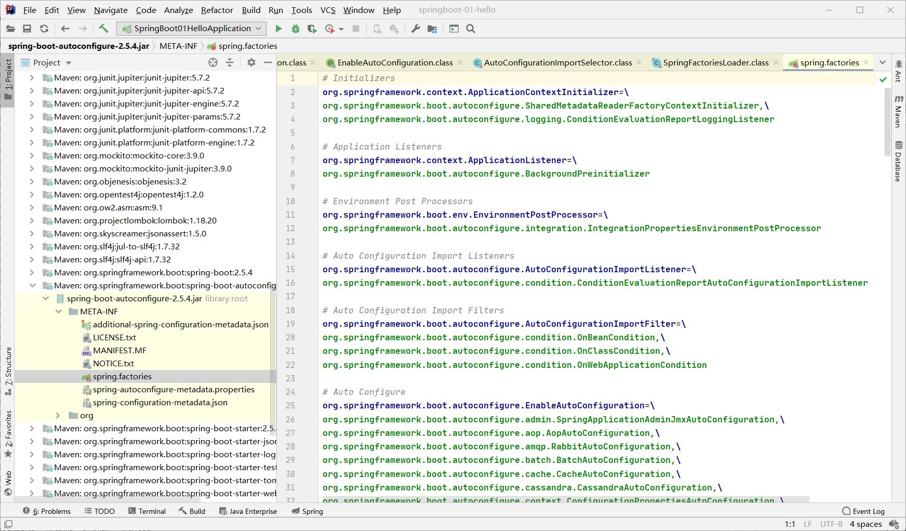

## SpringBoot 运行原理

自从写了第一个 SpringBoot 程序后摸了几天鱼，现在回来研究一下 SpringBoot 的运行原理！

### 1. 依赖文件pom

之前 SpringBoot 创建的是一个 Maven 项目，所以对应的配置文件 pom.xml 中肯定包含了项目需要的所有依赖。点进 pom.xml 查看，发现只有几个启动器依赖，不过可以看到这个项目存在一个父项目 `spring-boot-starter-parent`

```xml
    <parent>
        <groupId>org.springframework.boot</groupId>
        <artifactId>spring-boot-starter-parent</artifactId>
        <version>2.5.4</version>
        <relativePath/> <!-- lookup parent from repository -->
    </parent>
```

点进这个父项目查看，发现没有 `dependencies` 部分，只有文件导出和插件等 `build` 配置；但它又依赖了一个父项目 `spring-boot-dependencies` 

```xml
  <parent>
    <groupId>org.springframework.boot</groupId>
    <artifactId>spring-boot-dependencies</artifactId>
    <version>2.5.4</version>
  </parent>
```

再次点进这个父项目，看到了2000多行的依赖配置，这才是项目需要的 jar 包依赖所在！其中，给许多依赖都配置了对应的版本，如

```xml
	<aspectj.version>1.9.7</aspectj.version>
```

引用时直接引用配置的版本号

```xml
      <dependency>
        <groupId>org.aspectj</groupId>
        <artifactId>aspectjrt</artifactId>
        <version>${aspectj.version}</version>
      </dependency>
```

所以我们在引入一些依赖的时候，不需要指定版本号，就是因为在依赖配置中已经选好了！但引入依赖配置中没有的依赖时，仍需指定其版本号。

### 2. 启动器

回到最初的 pom 文件上，可以看到 SpringBoot 启动器的依赖

```xml
        <dependency>
            <groupId>org.springframework.boot</groupId>
            <artifactId>spring-boot-starter</artifactId>
        </dependency>
        <dependency>
            <groupId>org.springframework.boot</groupId>
            <artifactId>spring-boot-starter-web</artifactId>
        </dependency>
```

启动器的作用就是加载模块的运行环境，如上面的 `spring-boot-starter` 就加载了 SpringBoot 的运行环境，`spring-boot-starter-web` 就加载了 Web 模块的运行环境！

SpringBoot 把模块的运行环境都提取为启动器，需要运行什么模块只需引入对应的启动器，就可以引入需要的所有依赖了！

### 3. 主启动类注解

创建完 SpringBoot 项目时，可以看到项目自带了一个带有 main 方法的类，即主启动类

```java
@SpringBootApplication
public class SpringBoot01HelloApplication {

    public static void main(String[] args) {
        SpringApplication.run(SpringBoot01HelloApplication.class, args);
    }

}
```

先从注解分析一下主启动类是个什么东西！

#### 3.1 @SpringBootApplication

**`@SpringBootApplication`**：标注在类上表明这个类是 SpringBoot 的主启动类，SpringBoot 就会运行这个类的 main 方法来启动 SpringBoot 应用。

点进这个注解，又可以看到许多其他注解，其中有三个重要的

```java
@SpringBootConfiguration
@EnableAutoConfiguration
@ComponentScan
public @interface SpringBootApplication
```

将主启动类上的 `@SpringBootApplication` 注解换成这三个注解，程序依然能够运行；不过为了方便，还是直接用 `@SpringBootApplication` 就行了！

其中，`@ComponentScan` 在 Spring 中已经见过了，它是一个非常重要的注解，作用为自动扫描并加载符合条件的组件（ Bean ）。

#### 3.2 @SpringBootConfiguration

**`@SpringBootConfiguration`**：标注在类上表明这个类是 SpringBoot 的配置类。

点进这个注解，可以看到 `@Configuration` 注解

```java
@Configuration
public @interface SpringBootConfiguration
```

说明标注了该注解的类就是一个配置类，对应 Spring 中的 XML 配置文件！

继续深入，又看到了 `@Component` 注解

```java
@Component
public @interface Configuration
```

这就说明，主启动类也是 Spring 中的组件，它负责的就是启动应用！

#### 3.3 @EnableAutoConfiguration

**`@EnableAutoConfiguration`**：标注在类上表明开启自动配置功能，将所有符合条件的 `@Configuration` 配置都创建为 bean，并加载到当前 SpringBoot 的 IoC 容器中。

点进这个注解，可以看到

```java
@AutoConfigurationPackage
@Import({AutoConfigurationImportSelector.class})
public @interface EnableAutoConfiguration
```

点进其中的 `@AutoConfigurationPackage` 注解，可以看到 `@import` 注解

```java
@Import({Registrar.class})
public @interface AutoConfigurationPackage
```

即 `@AutoConfigurationPackage` 注解的功能是由 `@Import`注解实现的，**主要作用就是将主启动类所在包及所有子包下的组件到扫描到 Spring 的 IoC 容器中，这也是为什么新建的包要和主启动类同级的原因了！**

**另一个注解 `@Import(AutoConfigurationImportSelector.class)` 才是最关键的。**通过**`AutoConfigurationImportSelector`** 类，`@EnableAutoConfiguration` 可以让 SpringBoot 应用将所有符合条件的 `@Configuration` 配置都创建为 bean，并加载到当前 SpringBoot 的 IoC 容器中。

在 `AutoConfigurationImportSelector` 类中，可以看到**获取候选配置**的方法 `getCandidateConfigurations`

```java
    // 获得候选的配置
    protected List<String> getCandidateConfigurations(AnnotationMetadata metadata, AnnotationAttributes attributes) {
        // 这里返回的就是一开始看到的启动自动导入配置文件的注解类 EnableAutoConfiguration
        List<String> configurations = SpringFactoriesLoader.loadFactoryNames(this.getSpringFactoriesLoaderFactoryClass(), this.getBeanClassLoader());
        Assert.notEmpty(configurations, "No auto configuration classes found in META-INF/spring.factories. If you are using a custom packaging, make sure that file is correct.");
        return configurations;
    }
```

这个方法调用了 `SpringFactoriesLoader` 类的 `loadFactoryNames` 方法以获取配置类

```java
    public static List<String> loadFactoryNames(Class<?> factoryType, @Nullable ClassLoader classLoader) {
        ...
        String factoryTypeName = factoryType.getName();
        // 又调用了 loadSpringFactories 方法
        return (List)loadSpringFactories(classLoaderToUse).getOrDefault(factoryTypeName, Collections.emptyList());
    }
```

上面又再次调用了同一个类下的 `loadSpringFactories` 方法，这个方法有点长，不过主要做了两件事

```java
    private static Map<String, List<String>> loadSpringFactories(ClassLoader classLoader) {
        // 获取名为 "META-INF/spring.factories" 的资源
        // ...
        // 将读取到的资源遍历，封装为一个 properties
        // ...
    }
```

到现在我也看晕了，不过可以看到一个出现多次的名字 `META-INF/spring.factories`，搜索这个文件，发现它在 `spring-boot-autoconfigure-2.5.4.jar`  里面，看来和自动装配关系匪浅！看看它都有什么东西



到这估计就有点恍然大悟了，**`spring.factories` 中包含了所有 SpringBoot 要自动装配的配置类，通过自动读取它们并装配，才实现了 SpringBoot 不需要我们进行什么配置也能直接运行的效果！**

例如，在里面找到个熟悉的关于 WebMVC 的配置

```properties
org.springframework.boot.autoconfigure.web.servlet.WebMvcAutoConfiguration,\
```

点进这个配置类，可以看到熟悉的前缀后缀、静态资源过滤等 WebMVC 的配置，即完成了之前使用 SpringMVC 时的配置（我也晕了可能是这样吧）。

**小结**

1. SpringBoot 在启动的时候从类路径下的 `META-INF/spring.factories` 文件中获取 `@EnableAutoConfiguration` 要自动装配的配置类，将这些配置类作为 bean 导入 IoC 容器中，自动配置就生效了。
2. 不是所有的 `AutoConfiguration` 自动配置类都会被装配，还要判断是否符合装配的条件 `@ConditionalOn...`（自动配置类的注解），只有符合条件这个类才会被装配！
3. 在容器中导入的 `AutoConfiguration` 自动配置类就是当前运行场景需要的所有组件，且已经配置完成，省去了我们手动进行配置的工作！

### 4. 主启动类方法

主启动类中只有一个 main 方法和一句话

```java
@SpringBootApplication
public class SpringBoot01HelloApplication {

    public static void main(String[] args) {
        SpringApplication.run(SpringBoot01HelloApplication.class, args);
    }

}
```

运行主启动类的 main 方法，开启的是整个 SpringBoot 的服务！核心就是 `SpringApplication.run` 方法，它包含两部分

1. `SpringApplication` 对象的实例化
2. `run` 方法的执行

查看 `SpringApplication` 类的构造器，可以发现它主要做了四件事

1. 判断应用类型是普通项目还是 Web 项目

   ```java
   this.webApplicationType = WebApplicationType.deduceFromClasspath();
   ```

2. 加载所有可用的初始化器，设置到 initializers 属性中（ `List<ApplicationContextInitializer<?>> initializers` ）

   ```java
   this.setInitializers(this.getSpringFactoriesInstances(ApplicationContextInitializer.class));
   ```

3. 加载所有可用的程序监听器，设置到 listeners 属性中（ `List<ApplicationListener<?>> listeners` ）

   ```java
   this.setListeners(this.getSpringFactoriesInstances(ApplicationListener.class));
   ```

4. 推断并设置 main 方法的定义类，找到运行的主类

   ```java
   this.mainApplicationClass = this.deduceMainApplicationClass();
   ```

至于 `run` 方法的执行流程以后再说吧，我已经要吐了。

### 5. 总结

简单了解一下 SpringBoot 的运行原理······只能说是硬着头皮看，看不明白也没办法。

**一点点理解**：SpringBoot 通过启动器的依赖，判断要自动装配哪些配置类，这些 Spring 配置类采用的是 JavaConfig 的方式，即使用 `@Configuration` 注解进行配置，进行了许多默认的配置，即所谓的**约定**；如不手动进行配置的更改，则会按照默认的配置运行，避免了重复配置的过程，即**约定大于配置**。

希望看出来的一点点理解是正确的吧，这种东西就应该放到最后😡！

