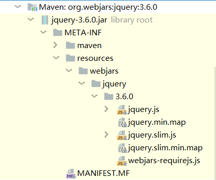
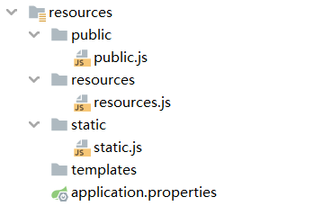

## SpringBoot 静态资源导入及首页设置

本节了解一下 SpringBoot 中 Web 开发的静态资源导入和首页设置，对应 SpringBoot-03-Web 项目。

### 1. 静态资源导入

在 Web 开发过程中，我们需要接触许多的静态资源，如 CSS、JS、图片等；在之前的开发过程中，这些资源都放在 Web 的目录下，用到的时候按照对应路径访问即可。不过在 SpringBoot 项目中，没有了 Web 的目录，那这些静态资源该放到哪里去，又要如何访问呢？

由于是 Web 应用中的配置，所以查看对应的自动配置类 `WebMvcAutoConfiguration`，可以看到处理资源的方法 `addResourceHandlers`

```java
@Override
public void addResourceHandlers(ResourceHandlerRegistry registry) {
    if (!this.resourceProperties.isAddMappings()) {
        logger.debug("Default resource handling disabled");
        return;
    }
    addResourceHandler(registry, "/webjars/**", "classpath:/META-INF/resources/webjars/");
    addResourceHandler(registry, this.mvcProperties.getStaticPathPattern(), (registration) -> {
        registration.addResourceLocations(this.resourceProperties.getStaticLocations());
        if (this.servletContext != null) {
            ServletContextResource resource = new ServletContextResource(this.servletContext, SERVLET_LOCATION);
            registration.addResourceLocations(resource);
        }
    });
}
```

其中，`this.resourceProperties.isAddMappings()` 的作用为判断是否在配置文件中指定了资源的访问路径，若指定了则此方法不用生效，直接返回；若未指定则继续执行方法，去默认的位置查找资源。

#### 1.1 WebJars

WebJars 是前端资源的 Jar 包形式，让我们可以通过 Jar 包的形式使用前端的框架、组件。

WebJars 网站：https://www.webjars.org/ 。

> 为什么要使用 WebJars？
>
> 我们在开发 Java web 项目的时候会使用像 Maven，Gradle 等构建工具以实现对 jar 包版本依赖管理，以及项目的自动化管理，但是对于 JS，Css 等前端资源包，我们只能采用拷贝到 webapp 目录下的手工方式，这样做就无法对这些资源进行依赖管理，而且容易导致文件混乱、版本不一致等问题。**WebJars 就提供给我们这些前端资源的 jar 包形式**，我们就可以进行**依赖管理**。

如要使用到 JQuery 时，按照之前的做法，我们要去网上下载 JQuery 的 JS 文件，把它放到 web 目录下的 statics/js 下（之前用 AJAX 的时候就是这么干的）；但现在，我们可以采用 WebJars 的方式。

首先在 WebJars 网站中找到 JQuery 的 Maven 坐标，把它放到项目的 pom 文件中

```xml
<dependency>
    <groupId>org.webjars</groupId>
    <artifactId>jquery</artifactId>
    <version>3.6.0</version>
</dependency>
```

引入后，在项目的 External Libaries 中就可以看到 org.webjars:jquery:3.6.0 了！



那么我们要怎么访问到它呢？在上面的源码中其实就已经给出了路径

```java
addResourceHandler(registry, "/webjars/**", "classpath:/META-INF/resources/webjars/");
```

这行代码将 `/webjars/` 下的所有访问都映射为了 `classpath:/META-INF/resources/webjars/`，即我们只需要通过 `/webjars/` 就可以找到类路径下的 `/jquery/3.6.0/jquery.js` 文件了！

运行项目，在浏览器中输入 `http://localhost:8080/webjars/jquery/3.6.0/jquery.js`，确实显示出了 jquery.js 文件！

以 WebJars 方式引入的文件，都符合上图中的结构，即能通过 `classpath:/META-INF/resources/webjars/` 路径访问到，这样代码中的设置和外部文件就联系起来了！

#### 1.2 staticPathPattern

回到源码中，这个方法的三句话还有最后一句（虽然很长但确实是一句）

```java
addResourceHandler(registry, this.mvcProperties.getStaticPathPattern(), (registration) -> {
    registration.addResourceLocations(this.resourceProperties.getStaticLocations());
    if (this.servletContext != null) {
        ServletContextResource resource = new ServletContextResource(this.servletContext, SERVLET_LOCATION);
        registration.addResourceLocations(resource);
    }
});
```

这就有点复杂了（之前版本的源码倒还好理解一点），不过可以看到获取静态路径 `getStaticPathPattern()` 方法，点进去

```java
public String getStaticPathPattern() {
    return this.staticPathPattern;
}
```

这个方法直接返回了 `staticPathPattern`，继续点

```java
/**
 * Path pattern used for static resources.
 */
private String staticPathPattern = "/**";
```

到这就明白了，其实就是默认的静态资源路径！这个路径也可以通过 spring.mvc 去设置，在未设置的情况在，它就是项目下的所有路径 `/**`！

然后在 Web 属性类 WebProperties 中有一个资源类 `Resource`，它也设置了4个路径（跳跃的有点大，先看着吧），其中

```java
public static class Resources {

    private static final String[] CLASSPATH_RESOURCE_LOCATIONS = { "classpath:/META-INF/resources/",
                                                                  "classpath:/resources/", "classpath:/static/", "classpath:/public/" };
    ...
}
```

1. `classpath:/META-INF/resources/` 即上面的 WebJars 路径
2. `classpath:/resources/` 即 `resources/resources/` 路径
3. `classpath:/static/` 为 `resources/static/` 路径
4. `classpath:/public/` 为 `resources/public ` 路径

**即所有通过 `/**`（未配置情况下）的访问请求，都会在这四个路径中寻找静态资源！** 

默认的 resource 中只有 static 一个目录，这里把上面的目录都创建一下，且放入一个测试用的 js 文件



此时运行项目，访问 `http://localhost:8080/public.js`、`http://localhost:8080/resources.js`、`http://localhost:8080/static.js`，都可以显示出对应的 js 文件内容！

**注意**：如果三个目录下的文件有重名的情况，则优先级为 `CLASSPATH_RESOURCE_LOCATIONS` 数组的顺序，可以理解为如果在前面的路径中找到了就不找后面的了！

### 2. 首页设置

和上面一样，先找到对应的源码

```java
@Bean
public WelcomePageHandlerMapping welcomePageHandlerMapping(ApplicationContext applicationContext,
                                                           FormattingConversionService mvcConversionService, ResourceUrlProvider mvcResourceUrlProvider) {
    WelcomePageHandlerMapping welcomePageHandlerMapping = new WelcomePageHandlerMapping(
        new TemplateAvailabilityProviders(applicationContext), applicationContext, getWelcomePage(),
        this.mvcProperties.getStaticPathPattern());
    welcomePageHandlerMapping.setInterceptors(getInterceptors(mvcConversionService, mvcResourceUrlProvider));
    welcomePageHandlerMapping.setCorsConfigurations(getCorsConfigurations());
    return welcomePageHandlerMapping;
}
```

很长也很复杂，不过只需要关注里面的 `getWelcomePage()` 方法，点进去看看

```java
private Resource getWelcomePage() {
    for (String location : this.resourceProperties.getStaticLocations()) {
        Resource indexHtml = getIndexHtml(location);
        if (indexHtml != null) {
            return indexHtml;
        }
    }
    ServletContext servletContext = getServletContext();
    if (servletContext != null) {
        return getIndexHtml(new ServletContextResource(servletContext, SERVLET_LOCATION));
    }
    return null;
}

private Resource getIndexHtml(String location) {
    return getIndexHtml(this.resourceLoader.getResource(location));
}

private Resource getIndexHtml(Resource location) {
    try {
        Resource resource = location.createRelative("index.html");
        if (resource.exists() && (resource.getURL() != null)) {
            return resource;
        }
    }
    catch (Exception ex) {
    }
    return null;
}
```

这三个方法是逐层调用的关系（虽然我也不知道为什么要这么干），不过可以知道，其中的 `location` 就是上面的三个目录 `resources`、`static`、`public`，默认的首页是 `index.html`。也就是说，如果这三个目录下存在 `index.html` 文件，那么它就是默认的首页！演示就省略了，反正也不是什么难点！

### 3. 总结

本节主要是从源码的角度，研究了一下静态资源导入和首页设置的问题。其实学习结论很简单，但从源码出发思考问题的思想，是不容易学习的🤔。
