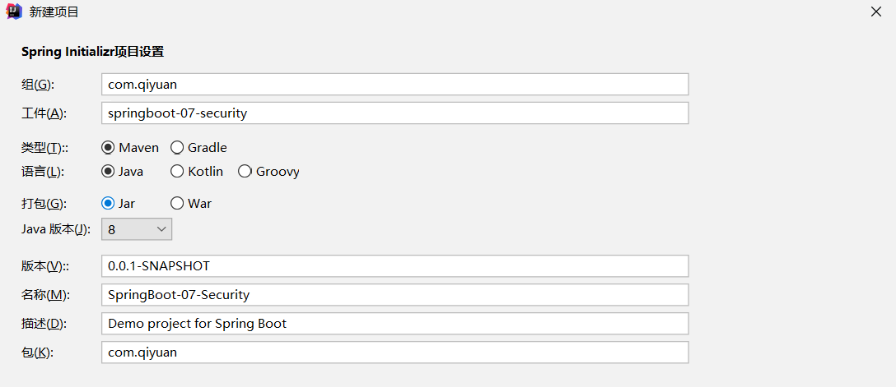
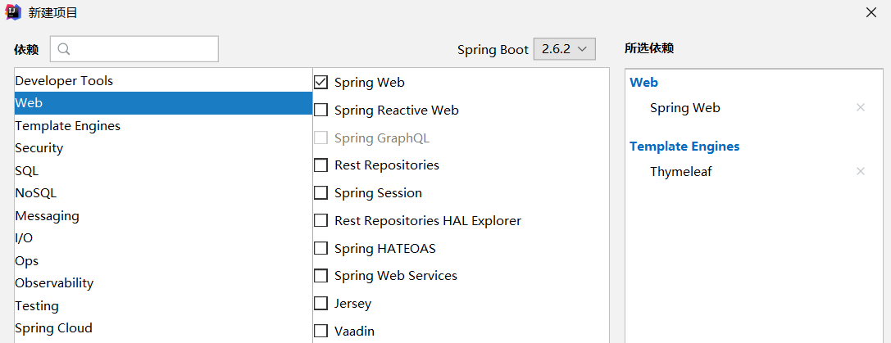
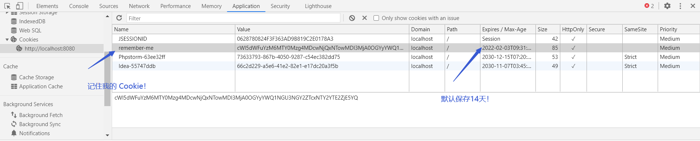
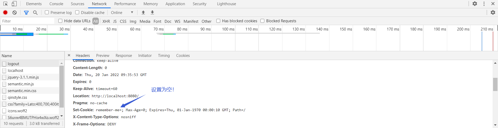

## SpringSecurity 简单使用

在 Web 开发中安全是不可忽视的问题（软件安全技术！），现在从 SpringSecurity 和 Shiro 两个框架来学习一下安全框架在 Web 应用中的使用。

> Spring Security is a powerful and highly customizable authentication and access-control framework. It is the de-facto standard for securing Spring-based applications.
>
> Spring Security is a framework that focuses on providing both authentication and authorization to Java applications. Like all Spring projects, the real power of Spring Security is found in how easily it can be extended to meet custom requirements.
>
> Spring Security是一个功能强大且高度可定制的身份验证和访问控制框架。它是保护基于Spring的应用程序的事实标准。
>
> Spring Security是一个框架，它关注于为Java应用程序提供身份验证和授权。与所有Spring项目一样，Spring安全性的真正威力在于它可以多么容易地扩展以满足定制需求。

在 Web 开发中，安全是非常重要的一个方面。Web 应用的安全性包括用户认证（Authentication）和用户授权（Authorization）两个部分，这两种需求 Spring Security 框架都有很好的支持。在用户认证方面，Spring Security 框架支持主流的认证方式，包括 HTTP 基本认证、HTTP 表单验证、HTTP 摘要认证、OpenID 和 LDAP 等。在用户授权方面，Spring Security 提供了基于角色的访问控制和访问控制列表（Access Control List，ACL），可以对应用中的领域对象进行细粒度的控制。

简单来说，SpringSecurity 框架可以进行用户认证和授权，简化了原本 Web 应用中过滤器、拦截器冗余的代码！

### 1. 环境搭建

新建项目 SpringBoot-07-Security，添加 Web 模块和 Thymeleaf 模块。





然后在项目中导入静态资源（css、js、html），在 static 和 templates 目录下，资源引用自

> https://gitee.com/cao_jianhua/spring-security?_from=gitee_search
>
> 目录结构：（resource）
>
> static
>
> —qiyuan
>
> ——css
>
> ——js
>
> templates
>
> —index.html
>
> —views
>
> ——level1
>
> ———1.html
>
> ———2.html
>
> ———3.html
>
> ——level2（）
>
> ——level3（）
>
> ——login.html

然后在配置文件中关闭 Thymeleaf 的缓存

```properties
spring.thymeleaf.cache=false
```

再写一个控制器尝试访问一下页面

```java
@Controller
public class RouterController {
    // 使用多个请求，要用 { } 括起来表明是数组！
    @RequestMapping({"/","/index"})
    public String index(){
        return "index";
    }

    @RequestMapping("/toLogin")
    public String toLogin(){
        return "views/login";
    }

    // 按照请求的等级和 id 进入对应的页面
    @RequestMapping("/level1/{id}")
    public String level1(@PathVariable("id")int id){
        return "views/level1/"+id;
    }
    @RequestMapping("/level2/{id}")
    public String level2(@PathVariable("id")int id){
        return "views/level2/"+id;
    }
    @RequestMapping("/level3/{id}")
    public String level3(@PathVariable("id")int id){
        return "views/level3/"+id;
    }
}
```

通过请求能访问到页面，环境搭建就完成了！

### 2. 用户认证和授权

为了用 SpringSecurity 实现安全控制，需要引入 spring-boot-starter-security 依赖！

```xml
<dependency>
   <groupId>org.springframework.boot</groupId>
   <artifactId>spring-boot-starter-security</artifactId>
</dependency>
```

在使用前，先了解三个重要的类和注解

- WebSecurityConfigrerAdapter：自定义 Security 策略
- AuthenticationManagerBuilder：自定义认证策略
- @EnableWebSecurity：开启 WebSecurity 模式（@Enable 就是开启！）

SpringSecurity 的主要目标就是**认证**和**授权**。

#### 2.1 用户授权

导入相关依赖后，需要进行 SpringSecurity 的配置，在 com.qiyuan.config 包下创建 `SecurityConfig` 类，继承 `WebSecurityConfigrerAdapter`；

 使用 Ctrl + O 可以查看父类方法并重写 `configure(HttpSecurity http)` 方法，进行**授权**的设置（重写的内容可以在源码的注释中查看！）

```java
// AOP 拦截器
@EnableWebSecurity
public class SecurityConfig extends WebSecurityConfigurerAdapter {
    @Override
    // 授权
    protected void configure(HttpSecurity http) throws Exception {
        // 链式编程
        // 请求授权的设置
        http.authorizeRequests()
                .antMatchers("/","/index").permitAll()
                .antMatchers("/level1/**").hasRole("VIP1")
                .antMatchers("/level2/**").hasRole("VIP2")
                .antMatchers("/level3/**").hasRole("VIP3");
        // 没有权限前往登录页面
        http.formLogin();
    }
}
```

其中可以直接设定前往某页面所需的权限，再通过 `formLogin()` 方法使无权限的前往登录页面（这个登录页页面甚至是 SpringSecurity 自带的，请求为 `/login`）。

#### 2.2 用户认证

再重写 `configure(AuthenticationManagerBuilder auth)` 方法进行**认证**的设置

```java
// AOP 拦截器
@EnableWebSecurity
public class SecurityConfig extends WebSecurityConfigurerAdapter {
    ...

    @Override
    // 认证
    protected void configure(AuthenticationManagerBuilder auth) throws Exception {
        // auth.jdbcAuthentication() 从数据库获取认证信息
        // 现在没有数据库，只能从内存中获取认证信息
        auth.inMemoryAuthentication()
                .withUser("qiyuanc1").password("0723").roles("VIP1")
                .and()
                .withUser("qiyuanc2").password("0723").roles("VIP1","VIP2")
                .and()
                .withUser("qiyuanc3").password("0723").roles("VIP1","VIP2","VIP3");
    }
}
```

如果就这样运行，按照设置好的用户名密码登录时会报错：`There is no PasswordEncoder mapped for the id "null"`，这是因为将用户名密码保存在内存中，需要对密码进行加密，防止反编译！SpringSecurity 推荐使用 BCrypt 加密方式，修改代码为

```java
// AOP 拦截器
@EnableWebSecurity
public class SecurityConfig extends WebSecurityConfigurerAdapter {
    ...

    @Override
    // 认证
    protected void configure(AuthenticationManagerBuilder auth) throws Exception {
        // auth.jdbcAuthentication() 从数据库获取认证信息
        // 现在没有数据库，只能从内存中获取认证信息
        auth.inMemoryAuthentication().passwordEncoder(new BCryptPasswordEncoder())
                .withUser("qiyuanc1").password(new BCryptPasswordEncoder().encode("0723")).roles("VIP1")
                .and()
                .withUser("qiyuanc2").password(new BCryptPasswordEncoder().encode("0723")).roles("VIP1","VIP2")
                .and()
                .withUser("qiyuanc3").password(new BCryptPasswordEncoder().encode("0723")).roles("VIP1","VIP2","VIP3");
    }
}
```

这样内存中的身份验证就搞定了，但 JDBC 身份验证还没试过，具体参考

> https://docs.spring.io/spring-security/site/docs/5.2.0.RELEASE/reference/htmlsingle/#jc-authentication-inmemory

后面综合到一起的时候再做。

### 3. 注销及权限控制

#### 3.1 注销

和开启 SpringSecurity 自带的登录功能一样，一句话开启注销功能，对应的请求默认为 `/logout`

```java
        // 没有权限前往登录页面
        http.formLogin();
        // 开启注销功能
        http.logout();
```

然后在前端添加发起注销请求的按钮

```html
<a class="item" th:href="@{/logout}">
    <i class="sign-out icon"></i> 注销
</a>
```

这样就能注销当前登录的用户了，不过注销后默认会回到登录界面，再进行设置使注销后回到首页

```java
        // 开启注销功能，注销成功回到首页
        http.logout().logoutSuccessUrl("/");
```

这样注销功能就非常完善了！

#### 3.2 权限控制

现在又有了新的权限控制问题：对于不同的角色（如 VIP1 和 VIP2）和不同的状态（登录和未登录），他们看同一页面的内容应该是不同的。如，VIP1 应该无法看到 level2 的内容；登录用户不用看到登录按钮，而要看到注销按钮；未登录用户不用看到注销按钮，而要看到登录按钮。这就是真实网站的情况！

想要实现这种涉及前端显示的权限控制，当然需要前端页面的支持，结合 Thymeleaf 中的一些功能。

导入 Thymeleaf 扩展 SpringSecurity 的依赖

```xml
<!-- Thymeleaf 扩展 SpringSecurity -->
<dependency>
    <groupId>org.thymeleaf.extras</groupId>
    <artifactId>thymeleaf-extras-springsecurity5</artifactId>
    <version>3.0.4.RELEASE</version>
</dependency>
```

还需要在前端页面导入命名空间

```html
xmlns:sec="http://www.thymeleaf.org/thymeleaf-extras-springsecurity5"
```

然后在前端页面中，使用 Thymeleaf 的 `sec:authorize` 标签及 `isAuthenticated()` 方法判断当前角色是否经过验证；

如未登录时，该标签取非判断生效，显示登录按钮

```html
<!--如果没有登录-->
<div sec:authorize="!isAuthenticated()">
    <a class="item" th:href="@{/login}">
        <i class="address card icon"></i> 登录
    </a>
</div>
```

以及登录后，该标签本身判断生效，显示用户名、角色及注销按钮

```html
<div sec:authorize="isAuthenticated()">
    <!--如果登录则显示 用户名 角色-->
    <a class="item">
        用户名：<span sec:authentication="name"></span>
        角色：<span sec:authentication="authorities"></span>
    </a>
</div>
<div sec:authorize="isAuthenticated()">
    <!--如果登录则显示 注销-->
    <a class="item" th:href="@{/logout}">
        <i class="sign-out icon"></i> 注销
    </a>
</div>
```

这样登录和未登录用户的界面就区分开了！

现在还剩下一个问题：不同权限的用户应该要看到不同的内容。同样使用 `sec:authorize` 标签和 `hasAuthority()` 方法实现

```html
<div class="ui raised segment" sec:authorize="hasAuthority('ROLE_VIP1')">
    <!-- VIP1 的内容 -->
</div>
<div class="ui raised segment" sec:authorize="hasAuthority('ROLE_VIP2')">
    <!-- VIP2 的内容 -->
</div>
<div class="ui raised segment" sec:authorize="hasAuthority('ROLE_VIP3')">
    <!-- VIP3 的内容 -->
</div>
```

前端通过获取当前用户的权限信息，判断是否显示某些内容！如此权限控制也完成了！

### 4. 记住我及定制登录页

#### 4.1 记住我

记住我是一个非常常用且实用的功能，避免了进入同一个网站需要多次登录的情况。在 SpringSecurity 框架的帮助下，想要开启记住我功能，只需在 `configure(HttpSecurity http)` 中开启

```java
        // 开启记住我功能
        http.rememberMe();
```

这样在自带的登录页上就会出现记住我的选项了！

选择记住我并登录后，在浏览器的控制台中查看 Cookie，可以看到出现了一条名为 `remember-me` 的 Cookie，默认保留14天，这就是 SpringSecurity 帮我们创建的了



注销时，SpringSecurity 又会将这条 Cookie 设置为空



使用记住我后免登录的流程为：登录成功后，服务器将 Cookie 发送给浏览器于本地保存，以后发起请求时带上这条 Cookie，服务器检查通过则不用登陆；注销操作则会删除这个 Cookie。

#### 4.2 定制登录页

之前使用的登录页面都是 SpringSecurity 自带的，虽然也挺好看的，但实际业务中还是要使用自己写的。

想要更换登录页面，只需添加 `http.formLogin()` 的设置，如

```java
        http.formLogin().loginPage("/toLogin");
```

这样前往登录页面的请求就是 `/toLogin` 了，同时官方的登录页面已经被覆盖，前端的登录请求也需要由 `/login` 修改为 `/toLogin`。

这就产生了一个问题：之前使用官方的登录页面，SpringSecurity 可以直接获取我们登录的参数，现在使用了自己的登录页面，要怎么把参数交给 SpringSecurity 呢？

解决方法同上，也是扩展 `http.formLogin()` 的设置即可

```java
        http.formLogin()
                .loginPage("/toLogin")
                // 登录需要的参数
                .usernameParameter("username")
                .passwordParameter("password")
                // 登录请求交给 SpringSecurity
                .loginProcessingUrl("/login");
```

为了让 SpringSecurity 获得登录的参数，需要配置接收的参数，即 username 和 password；同时要设置将登录请求提交给 `/login`，即交给 SpringSecurity 处理。

之前添加的记住我功能也需要扩展配置，前端添加记住我的选择栏，提交参数为 remeber

```html
<div class="field">
    <input type="checkbox" name="remember">记住我
</div>
```

然后添加 `http.remeberMe()` 的设置

```java
        http.rememberMe().rememberMeParameter("remeber");
```

最后还会遇到一个问题：注销请求 `/logout` 找不到页面。这是由于 SpringSecurity 开启了 CSRF 防御功能导致的，logout 请求需要以 post 方式提交才可以。不过由于链接不是表单，不好调整，可以直接关闭此功能

```java
        // 关闭 csrf 防御
        http.csrf().disable();
```

至此使用自己的登录页面，所有功能都是成功的了！其实就相当于套了层皮（自己的登录页），实际的登录参数仍要交给 SpringSecurity 去处理，只要配置好数据的转发就好了。

### 5. 总结

对 SpringSecurity 框架简单地使用后发现，它其实就是对过滤器和拦截器进行了封装，使得进行认证和授权变得更加简单，同时它还运用了 AOP 的方式，不影响之前的代码，只要横切进去，管理安全相关的事务就可以了。非常好用，下次还用😋！

